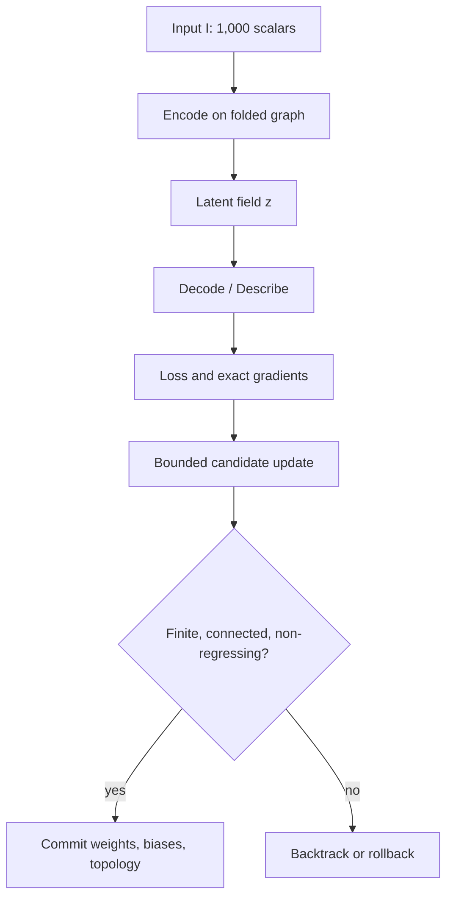

# Dr Moagi 10x10x10 Inward 4D Auto-Optimizing ANN

## Status and implemented boundary

This document specifies the dependency-free reference implemented in
`src/jarvisx/inward4d_ann.py`.

It implements:

- a `10 x 10 x 10` lattice with exactly 1,000 nodes;
- a deterministic coordinate feature map from the lattice into `R^4`;
- open-cube and fully wrapped six-neighbour graph topologies;
- a tied, same-width graph encoder and decoder;
- an explicit self-reconstruction objective;
- analytic reverse-mode gradients;
- non-negative bounded synaptic weights;
- connectivity-preserving pruning;
- candidate evaluation, commit, rollback, and audit telemetry.

The fourth value is a mathematical feature coordinate. It is not time, a claim
about physical spacetime, or evidence of a quantum process. The latent field has
1,000 scalars, so this reference is an autoencoder but not a compressor. The
fixed-point tolerance is a stopping test for a supplied input; it is not a proof
that every possible input converges.

## 1. State and indexing

Let the lattice side be `n = 10`. Its coordinates and node count are

\[
(x,y,z)\in\{0,\ldots,9\}^3,
\qquad N=n^3=1000.
\]

The authoritative linear address is

\[
\boxed{i(x,y,z)=n^2x+ny+z=100x+10y+z.}
\]

The inverse is

\[
x=\left\lfloor\frac{i}{100}\right\rfloor,
\qquad
y=\left\lfloor\frac{i\bmod100}{10}\right\rfloor,
\qquad
z=i\bmod10.
\]

Normalized box coordinates are

\[
u_x=\frac{2x}{9}-1,
\qquad
u_y=\frac{2y}{9}-1,
\qquad
u_z=\frac{2z}{9}-1.
\]

Every integer index round-trips through these discrete coordinates; floating
point geometry never becomes an address.

## 2. Inward `R^4` fold

### 2.1 Flat box

For spacing `S = 2.2`, the centered flat coordinate is

\[
\mathbf B(x,y,z)=
\left(
S(x-4.5),
S(y-4.5),
S(z-4.5),
0
\right).
\]

### 2.2 Toroidal feature coordinate

Use three discrete phase angles

\[
\theta_x=\frac{2\pi x}{10},
\qquad
\theta_y=\frac{2\pi y}{10},
\qquad
\theta_z=\frac{2\pi z}{10}.
\]

The layer radius is

\[
\boxed{r(z)=2.5+1.5\frac{z}{9},}
\]

so `r(0) = 2.5` and `r(9) = 4.0`. With major radius `R = 4.5`, define

\[
\begin{aligned}
T_0&=(R+r\cos\theta_y)\cos\theta_x,\\
T_1&=(R+r\cos\theta_y)\sin\theta_x,\\
T_2&=r\sin\theta_y\cos\theta_z,\\
T_3&=r\sin\theta_y\sin\theta_z.
\end{aligned}
\]

This is the engine's deterministic `R^4` coordinate feature map. The runtime
does not require the map to be a globally isometric embedding of a continuous
three-torus; graph topology remains discrete and authoritative.

### 2.3 Fold interpolation

For fold factor `gamma in [0,1]`,

\[
\boxed{
\mathbf q_\gamma(x,y,z)
=(1-\gamma)\mathbf B(x,y,z)+\gamma\mathbf T(x,y,z).
}
\]

- `gamma = 0`: flat `R^3` box carried in `R^4` with `q_3 = 0`;
- `gamma = 1`: fully folded toroidal feature coordinates;
- intermediate values: a deterministic coordinate interpolation, not a
  physical deformation claim.

## 3. Synaptic graph

### 3.1 Topological support

Each node proposes one positive-direction neighbour on each axis. Internal
edges use `c + 1`; seam edges use `(c + 1) mod 10` when folding is enabled.
The graph is undirected, so one weight is authoritative for both directions:

\[
w_{ij}=w_{ji},
\qquad 0\leq w_{ij}\leq1.
\]

The exact open-cube edge count is

\[
\boxed{M_{flat}=3(n-1)n^2=3(9)(100)=2700.}
\]

Closing one seam per axis contributes

\[
\boxed{M_{seam}=3n^2=300,}
\]

therefore the fully wrapped count is

\[
\boxed{M_{wrapped}=M_{flat}+M_{seam}=3000.}
\]

This resolves the earlier approximate `2,700-3,100` range: 2,700 and 3,000
are exact for the declared six-neighbour contracts. A pure all-pairs radius
graph does not have a predetermined edge count and can be disconnected.

### 3.2 Folded distance and coupling

For a supported pair,

\[
d_{ij}^{(4)}=
\left\|\mathbf q_\gamma(i)-\mathbf q_\gamma(j)\right\|_2.
\]

The default proximity gate is `rho = 5.5`. A supported edge is admitted only
when `d_ij^(4) <= rho`. Its immutable geometry gain is

\[
g_{ij}=s_{ij}(\gamma)
\exp\left[-\frac12\left(\frac{d_{ij}^{(4)}}{\rho}\right)^2\right],
\]

where `s_ij = 1` for an internal edge and `s_ij = gamma` for a seam edge. At
full fold, the maximum supported edge distance is `5.2532889044`, so all 3,000
supported edges pass the `5.5` gate and every node has degree six.

## 4. Encoder, decoder, and self-description

Let `I in R^1000` be the input field. Let `d_i` be the active degree of node
`i`, `delta = 0.88`, and `kappa = 1-delta = 0.12`.

The encoder is

\[
p_i^E
=\delta I_i
+\frac{\kappa}{d_i}
\sum_{j\in\mathcal N(i)}w_{ij}g_{ij}I_j
+b_i^E,
\qquad
z_i=\tanh(p_i^E).
\]

The tied graph decoder is

\[
p_i^D
=\delta z_i
+\frac{\kappa}{d_i}
\sum_{j\in\mathcal N(i)}w_{ij}g_{ij}z_j
+b_i^D,
\qquad
\widehat I_i=\tanh(p_i^D).
\]

Therefore

\[
\boxed{
\operatorname{Describe}_\Theta(I)
=D_\Theta(E_\Theta(I))=\widehat I.
}
\]

`Theta` consists only of the active symmetric edge weights and the two bias
vectors. The geometry and node addresses are immutable during one engine
instance.

## 5. Objective functional

The reconstruction term is

\[
L_{rec}=\frac1N\sum_{i=0}^{N-1}(\widehat I_i-I_i)^2.
\]

The folded-field disagreement energy is

\[
L_E=\frac1{M_a}
\sum_{(i,j)\in E_a}
w_{ij}g_{ij}(z_i-z_j)^2.
\]

Energy alone would drive conductances toward zero. The runtime therefore uses
an explicit homeostatic anchor `w_0 = 0.40`:

\[
L_H=\frac1{M_a}\sum_{(i,j)\in E_a}(w_{ij}-w_0)^2.
\]

The bias penalty is

\[
L_B=\frac1{2N}
\left(\|b^E\|_2^2+\|b^D\|_2^2\right).
\]

The complete implemented objective is

\[
\boxed{
\mathcal L
=L_{rec}+0.02L_E+0.01L_H+10^{-4}L_B.
}
\]

This is self-supervised: the input is its own reconstruction target. It does not
require class labels, but it still requires an explicit objective and data.

## 6. Exact local gradient update

For one active undirected edge `e = (i,j)`, reverse-mode differentiation yields

\[
\frac{\partial\mathcal L}{\partial w_e}
=G_e^{decoder}
+G_e^{encoder}
+\frac{0.02}{M_a}g_e(z_i-z_j)^2
+\frac{0.02}{M_a}(w_e-w_0).
\]

The last coefficient is `2 * 0.01 / M_a`. The encoder and decoder terms are the
ordinary chain-rule contributions through both directions of the symmetric
edge. The implementation also propagates `L_E` through `z`; it does not treat
the latent values as constants.

The proposed update is

\[
\boxed{
w_e'=\operatorname{clip}_{[0,1]}
\left(w_e-0.005\frac{\partial\mathcal L}{\partial w_e}\right).
}
\]

Biases use the same learning rate and are clipped to `[-2,2]`. If the full
candidate objective increases, the engine retries with learning rates
`eta/2, eta/4, ...` for at most six backtracks. No proposed value is
authoritative before evaluation.

## 7. Structural pruning

Every 25 epochs, an active edge becomes a pruning candidate when

\[
\boxed{w_e<\tau_{prune}=0.15.}
\]

Because this reference constrains weights to be non-negative, this is equivalent
to `abs(w_e) < 0.15`. Candidates are processed deterministically by weight and
node address. An edge is removed only if:

1. both endpoint degrees remain at or above the configured minimum;
2. the complete 1,000-node graph remains connected;
3. the full post-pruning objective passes the non-regression gate.

Pruning is symmetric because each undirected pair has one active flag and one
weight.

## 8. End-to-end transaction



The complete execution order is:

1. validate configuration and build 1,000 immutable addresses;
2. compute flat and toroidal coordinates, then `q_gamma`;
3. build unique symmetric positive-axis edges;
4. gate supported edges by folded distance and validate connectivity;
5. validate exactly 1,000 finite input values;
6. execute encoder graph propagation and `tanh`;
7. execute tied decoder graph propagation and `tanh`;
8. compute reconstruction, energy, homeostasis, and bias losses;
9. differentiate the complete smooth objective;
10. create bounded weight and bias candidates;
11. optionally propose connectivity-preserving pruning;
12. evaluate the candidate and commit only on non-regression, otherwise
    backtrack or roll back;
13. emit epoch, loss, residual, learning rate, active-edge, pruning, and
    convergence telemetry.

## 9. Worked arithmetic

For node `(x,y,z) = (2,3,4)`:

\[
i=100(2)+10(3)+4=234.
\]

Its flat point is

\[
\mathbf B=(-5.5,-3.3,-1.1,0).
\]

Its layer radius and phases are

\[
r=2.5+1.5\frac49=3.1666666667,
\]

\[
(\theta_x,\theta_y,\theta_z)
=(0.4\pi,0.6\pi,0.8\pi).
\]

At full fold,

\[
\boxed{
\mathbf q_1(2,3,4)
=(1.088186716,
  3.349094341,
 -2.436499467,
  1.770220482).
}
\]

The positive-z neighbour is node `235`. Their folded distance and gain are

\[
d_{234,235}^{(4)}=1.916933105,
\qquad
g_{234,235}=0.941070024.
\]

For one illustrative encoder node with `I_i = 0.4` and a complete weighted
neighbour sum of `0.9`,

\[
p_i^E=0.88(0.4)+\frac{0.12}{6}(0.9)=0.3700000000,
\]

\[
z_i=\tanh(0.37)=0.3539917125.
\]

If the decoder weighted neighbour sum is `0.78`,

\[
p_i^D=0.88(0.3539917125)+\frac{0.12}{6}(0.78)
=0.3271127070,
\]

\[
\widehat I_i=\tanh(p_i^D)=0.3159240347.
\]

The node residual is `-0.0840759653`, contributing `0.0070687679` before the
`1/N` average. For an illustrative neighbouring latent value `z_j = 0.28` and
`w_ij = 0.4`, the unscaled local disagreement derivative is

\[
(z_i-z_j)^2=0.0054747735.
\]

If that were the only gradient term, one `eta = 0.005` update would give

\[
w_{ij}'=0.4-0.005(0.0054747735)=0.3999726261.
\]

The runtime uses the complete chain-rule gradient rather than this isolated
illustration.

## 10. Arithmetic summary

| Metric | Symbol | Operational value | Exact relationship |
|---|---:|---:|---|
| Grid | `n x n x n` | `10 x 10 x 10` | `N = n^3 = 1,000` |
| Address | `i` | `0 ... 999` | `i = 100x + 10y + z` |
| Spacing | `S` | `2.2` | centered flat step |
| Fold | `gamma` | `1.0` | `q_gamma = (1-gamma)B + gamma T` |
| Major radius | `R` | `4.5` | toroidal ring radius |
| Layer radius | `r(z)` | `2.5 ... 4.0` | `2.5 + 1.5z/9` |
| Proximity gate | `rho` | `5.5` | supported edge requires `d4 <= rho` |
| Open edges | `M_flat` | `2,700` | `3(n-1)n^2` |
| Seam edges | `M_seam` | `300` | `3n^2` |
| Full-fold edges | `M` | `3,000` | `3n^3` |
| Potential retention | `delta` | `0.88` | neighbour scale `1-delta = 0.12` |
| Learning rate | `eta` | `0.005` | backtracked on regression |
| Prune threshold | `tau_prune` | `0.15` | non-negative `w < tau` |
| Prune interval | `K` | `25` epochs | topology remains connected |
| Fixed-point target | `epsilon` | `< 10^-6` | `sqrt(L_rec) < epsilon` |

## 11. Complexity and resource bound

For `N = 1,000` and `M = 3,000`:

- folded coordinate construction: `O(N)`;
- graph construction: `O(N)` for fixed degree;
- one encode/decode evaluation: `O(N + M)`;
- one exact gradient: `O(N + M)`;
- adaptive scalar state: `M + 2N = 5,000` floating-point values plus topology;
- pruning: bounded by `M` candidates with explicit connectivity checks;
- optimization: bounded by `max_epochs` and at most six learning-rate
  backtracks per epoch.

No throughput, energy, HFT, or hardware superiority claim follows from these
operation counts. The implementation is a correctness-oriented Python
reference.

## 12. Verification contract

Focused tests verify:

- all 1,000 indices round-trip exactly;
- node `234` matches the closed-form `R^4` coordinate;
- flat and full-fold graphs contain exactly 2,700 and 3,000 edges;
- the full-fold graph is six-regular and connected;
- the zero field is an exact self-description fixed point;
- non-finite and dimensionally invalid inputs are rejected;
- analytic edge and bias gradients match central finite differences;
- equal initial state and input produce identical updates;
- committed objectives do not increase;
- validator rejection rolls parameters and topology back;
- pruning preserves symmetry, minimum degree, and connectivity;
- optimization respects its finite epoch budget.

Run the reference:

```bash
python examples/inward4d_ann_demo.py --epochs 25
```

Run focused verification:

```bash
pytest -q tests/test_inward4d_ann.py
```

## 13. What remains future work

- an undercomplete latent bottleneck with a separately measured rate-distortion
  trade-off;
- datasets and held-out reconstruction tests;
- sparse/native acceleration and reproducible benchmarks;
- checkpoint serialization with a version and topology digest;
- convergence analysis for declared input classes;
- comparison against ordinary grid, graph autoencoder, and convolutional
  baselines;
- ablation of the `R^4` geometry gain versus the same graph without folding.
