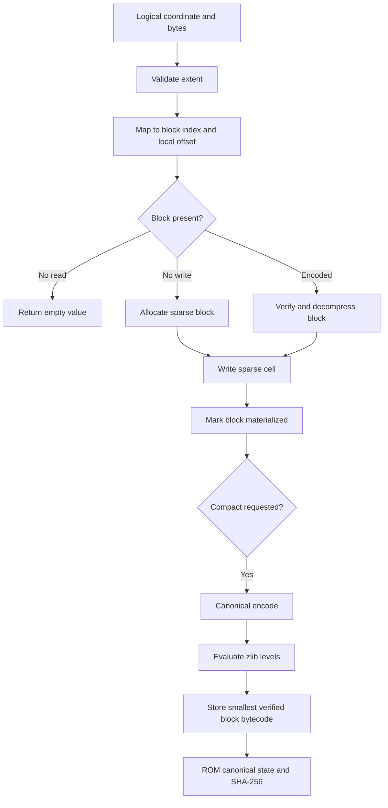

# Dr Moagi Sparse 3D Virtual Computer

## Status

Operational reference implementation for a sparse, block-addressed 3D logical
memory volume with deterministic compression, adaptive reblocking, exact ROM
restoration, and cryptographic integrity checks.

This module is a storage and address-space runtime. It does not claim that a
neural volumetric autoencoder is already trained or deployed. The initial codec
is a deterministic lossless zlib reference implementation behind a replaceable
block-codec boundary.

## 1. Correct capacity semantics

The original phrase `6400 x 6400 x 6400 GB` mixes spatial coordinates and data
units. The runtime separates them:

```text
extent      = number of logical cells on x, y, and z
cell_bytes  = maximum payload represented by one logical cell
block_shape = number of logical cells per block on x, y, and z
```

The logical capacity is:

\[
C = D H W c,
\]

where \(c\) is `cell_bytes`.

For an extent of `6400^3`:

- `cell_bytes = 1` gives `262,144,000,000` bytes, or 262.144 GB decimal;
- `cell_bytes = 1,000,000,000` gives
  `262,144,000,000,000,000,000` bytes, or 262.144 EB decimal.

The 262.144 EB interpretation therefore means **6400 logical cells per axis,
with each cell representing up to one gigabyte**. It is not byte-addressable at
the outer coordinate level. Byte-addressable operation uses `cell_bytes = 1`.

## 2. Block mapping

For a block shape \(B_x,B_y,B_z\), coordinate \((x,y,z)\) maps to:

\[
(i,j,k)=
\left(
\left\lfloor\frac{x}{B_x}\right\rfloor,
\left\lfloor\frac{y}{B_y}\right\rfloor,
\left\lfloor\frac{z}{B_z}\right\rfloor
\right),
\]

with local offset:

\[
(o_x,o_y,o_z)=
(x\bmod B_x,y\bmod B_y,z\bmod B_z).
\]

With an extent of 6400 and a block side of 1024, the block grid is:

\[
\left\lceil\frac{6400}{1024}\right\rceil^3=7^3=343.
\]

Boundary blocks are clipped. The final block on each axis has an effective side
of 256 cells rather than being padded to 1024 cells.

## 3. Two-level sparsity

The runtime never constructs a dense `B^3` array merely because a block has a
large logical shape.

```text
volume
  -> sparse dictionary of allocated block indices
      -> sparse dictionary of written local cell offsets
```

An unwritten read returns the empty byte string and does not allocate memory. A
non-empty write allocates exactly one block record and one cell payload. Writing
an empty payload deletes the cell and releases the block if it becomes empty.

Physical storage is therefore proportional to written content and metadata, not
to the logical capacity.

## 4. Block encoding

Each allocated block is serialized canonically:

```text
block index
block shape
cell capacity
sorted local offsets
base64 cell payloads
read/write counters
```

The canonical bytes are compressed independently at zlib levels 1 through 9.
The reference optimizer selects:

\[
C_b^\star=\arg\min_{C_b\in\{1,\ldots,9\}} S_b(C_b),
\]

with deterministic tie-breaking toward the lower compression level.

Because this reference codec is lossless:

\[
D_b=0,
\]

and its current block objective reduces to encoded size. A future learned codec
can expose a rate-distortion objective:

\[
J_b=\alpha R_b+\beta D_b,
\]

where \(R_b\) is the encoded byte rate and \(D_b\) is a declared geometric or
numeric distortion measure. PSNR is appropriate only for bounded numeric voxel
fields; it is not used for arbitrary byte payloads.

## 5. Adaptive layout optimization

`optimize_layout` evaluates the current block shape together with supplied
candidate shapes. Each candidate is rebuilt from the sparse written cells,
compressed, and scored as:

\[
J_{layout}=S_{encoded}+n_b S_{entry},
\]

where \(n_b\) is the number of allocated blocks and \(S_{entry}\) is the
configured layout-metadata cost.

The selected layout is the minimum-cost candidate with deterministic
 tie-breaking. Reblocking preserves all coordinates and values exactly.

This is global reblocking. Per-region octree split, merge, and heterogeneous
block shapes remain a follow-on subsystem.

## 6. Operational modes

### Online

Blocks remain materialized after access. Reads and writes are serviced directly
from sparse in-memory block state.

### Offline

Compacted blocks are retained as compressed bytecode and materialized only when
read or modified.

### Adaptive

Compaction behaves like offline mode, and the caller may periodically run layout
optimization against candidate block shapes.

The runtime does not create a hidden background optimizer. Optimization is an
explicit, auditable operation.

## 7. ROM format

A ROM envelope contains:

```text
schema version
volume geometry
operational mode
read/write counters
encoded block records
SHA-256 fingerprint of canonical state JSON
```

Saving uses a temporary file followed by atomic replacement. Loading verifies
the state fingerprint before accepting the ROM. Each block also carries a
checksum over its uncompressed canonical representation.

The two integrity layers are:

\[
h_b=\operatorname{SHA256}(\operatorname{decode}(b)),
\]

and:

\[
h_{ROM}=\operatorname{SHA256}(\operatorname{CanonicalJSON}(state)).
\]

These hashes establish deterministic integrity, not secrecy. Encryption and
signatures are separate concerns.

## 8. Python API

```python
from jarvisx.virtual3d import OperationalMode, Virtual3DComputer, VolumeGeometry

geometry = VolumeGeometry(
    extent=(6400, 6400, 6400),
    block_shape=(1024, 1024, 1024),
    cell_bytes=1_000_000_000,
)
computer = Virtual3DComputer(geometry, mode=OperationalMode.ADAPTIVE)

computer.write((10, 20, 30), b"Jarvis-X")
assert computer.read((10, 20, 30)) == b"Jarvis-X"

report = computer.optimize_layout(
    [(256, 256, 256), (512, 512, 512), (1024, 1024, 1024)]
)
fingerprint = computer.save_rom("jarvisx-state.jxrom")
restored = Virtual3DComputer.load_rom("jarvisx-state.jxrom")
```

## 9. Operational flow



## 10. Current boundary

Implemented now:

- exact 3D coordinate mapping;
- clipped boundary blocks;
- block- and cell-level lazy allocation;
- deterministic lossless per-block encoding;
- compression-level optimization;
- global exact reblocking;
- online, offline, and adaptive modes;
- ROM save/load;
- block checksums and ROM fingerprints;
- capacity, mapping, persistence, tamper, and reblocking tests.

Not yet implemented:

- neural 3D convolutional codecs;
- lossy quantization and domain-specific distortion metrics;
- heterogeneous block sizes within one active layout;
- octree split/merge policies driven by heat or entropy;
- memory-mapped or distributed backing stores;
- transaction isolation for concurrent writers;
- encryption, signatures, or erasure coding.

Those capabilities can now be added against a stable address, codec, layout,
and ROM contract rather than an undefined dense tensor.
