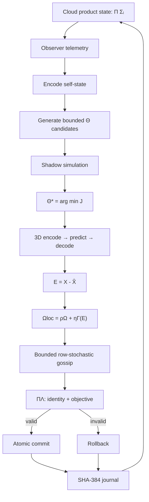

# Dr Moagi Cloud VM Master Equation

## Status

Executable reference specification for the distributed Jarvis-X Cloud VM Engine.

This document unifies local 3D encoding, latent prediction, decoding, residual memory,
neighbour gossip, bounded inward optimisation, invariant projection, atomic rollback,
and SHA-384 journaling. It is a systems model and reference implementation contract,
not a claim that the operators are a formally established physical law.

## 1. Global product state

The cloud state is a keyed product of node states, not an arithmetic union:

\[
\boxed{
\Sigma_{\mathrm{cloud},t}
=
\prod_{i\in V}\Sigma_{i,t}
}
\]

with

\[
\boxed{
\Sigma_{i,t}
=
(X_{i,t},G_{i,t},Z_{i,t},\widehat Z_{i,t},\widehat X_{i,t},E_{i,t},
\Omega_{i,t},\Lambda_i,\Theta_{i,t},\mathcal N_i,v_{i,t})
}
\]

where \(V\) is the node set and \(v_i\) is the committed node version.

The product notation matters: decoded input-space values cannot be added directly to a
heterogeneous state tuple. Every operator instead writes to a declared state component.

## 2. Local 3D auto-encoding transition

For every node \(i\):

\[
G_{i,t}=\operatorname{Morton3D}(X_{i,t})
\]

\[
Z_{i,t}=\mathcal E_{3D}(G_{i,t},\Omega_{i,t};\Theta_{i,t})
\]

\[
\widehat Z_{i,t}=\mathcal P(Z_{i,t},\Omega_{i,t};\Theta_{i,t})
\]

\[
\widehat X_{i,t}=\mathcal D_{3D}(\widehat Z_{i,t};\Theta_{i,t})
\]

\[
E_{i,t}=X_{i,t}-\widehat X_{i,t}
\]

The local memory proposal is

\[
\boxed{
\Omega^{\mathrm{loc}}_{i,t+1}
=
\rho_i\Omega_{i,t}+\eta_i\Gamma(E_{i,t})
}
\]

with \(0\leq\rho_i<1\), \(\eta_i>0\), and bounded write operator \(\Gamma\).

## 3. Row-stochastic gossip

Let \(A=[a_{ij}]\) be a row-stochastic neighbour matrix:

\[
a_{ij}\geq0,
\qquad
\sum_j a_{ij}=1.
\]

The distributed memory update is

\[
\boxed{
\Omega_{i,t+1}
=
(1-\kappa_i)\Omega^{\mathrm{loc}}_{i,t+1}
+
\kappa_i\sum_{j\in\mathcal N_i}a_{ij}\Omega^{\mathrm{loc}}_{j,t+1}
}
\]

where \(0\leq\kappa_i\leq1\). Including the local term prevents gossip from erasing
node-specific memory.

## 4. Performance objective

The cloud objective is

\[
\boxed{
J(\Sigma,\Theta)
=
\frac{1}{|V|}\sum_{i\in V}\|E_i\|_2^2
+\lambda_L L_{\mathrm{cloud}}
+\lambda_C C_{\mathrm{cloud}}
}
\]

where \(L_{\mathrm{cloud}}\) and \(C_{\mathrm{cloud}}\) are measurable latency and
resource-cost terms.

A differentiable optimiser would use projected gradient descent:

\[
\Theta'=
\Pi_{\mathcal B}
\left(
\Theta-\alpha\nabla_\Theta J
\right).
\]

The sign is negative because the engine minimises \(J\). The reference runtime uses a
bounded finite candidate set around the current parameters because topology, deployment,
and several runtime controls are discrete.

## 5. Observer and shadow cohorts

Let \(\mathcal O_t\subseteq V\) be the observer cohort and
\(\mathcal H_t\subseteq V\) the shadow cohort.

\[
Z^{\mathrm{self}}_t
=
\mathcal E_{\mathrm{self}}
\left(
\operatorname{Telemetry}(\Sigma_{\mathcal O_t,t})
\right)
\]

Candidate parameters are generated from bounded transformations:

\[
\mathcal C_t=\{\Theta_t^{(1)},\ldots,\Theta_t^{(K)}\}.
\]

Each candidate is counterfactually simulated and scored on the shadow cohort:

\[
J_k^{\mathrm{shadow}}
=
J
\left(
\mathcal F_{\Theta_t^{(k)}}(\Sigma_{\mathcal H_t,t}),
\Theta_t^{(k)}
\right).
\]

Selection is

\[
\boxed{
k^*=\arg\min_k J_k^{\mathrm{shadow}}}
\]

subject to parameter bounds and deployment policy.

## 6. Candidate cloud transition

The selected mechanics produce a complete candidate product state:

\[
\widetilde\Sigma_{\mathrm{cloud},t+1}
=
\mathcal F_{\Theta_t^{(k^*)}}
\left(
\Sigma_{\mathrm{cloud},t},X_t
\right).
\]

This single operator contains the local encode-predict-decode-residual-memory transition
followed by bounded gossip.

## 7. Sealed invariants

The identity invariant is structural rather than the tautology
\(\Phi(\Sigma)=\Sigma\). It preserves:

- the node-ID set;
- coordinate ownership;
- declared neighbour topology;
- input dimensionality;
- parameter bounds;
- journal continuity.

Write this predicate as

\[
I_{\mathrm{id}}
(\Sigma_t,\widetilde\Sigma_{t+1})=1.
\]

The performance invariant is

\[
J(\widetilde\Sigma_{t+1})
\leq
J(\Sigma_t)+\tau
\]

where \(\tau\geq0\) is a declared numerical or stochastic tolerance.

The projection is therefore

\[
\boxed{
\Pi_\Lambda(\widetilde\Sigma_{t+1})
=
\begin{cases}
\widetilde\Sigma_{t+1},
& I_{\mathrm{id}}=1\ \land\ J_{t+1}\leq J_t+\tau,\\
\Sigma_t,
& \text{otherwise.}
\end{cases}
}
\]

## 8. Transaction and journal

The state transition is atomic:

\[
\boxed{
\Sigma_{\mathrm{cloud},t+1}
=
\operatorname{Commit}_{\mathcal J}
\left(
\Pi_\Lambda
\left[
\mathcal F_{\Theta_t^{(k^*)}}
(\Sigma_{\mathrm{cloud},t},X_t)
\right]
\right)
}
\]

The journal head is

\[
\boxed{
\mathcal J_{t+1}
=
\operatorname{SHA384}
\left(
\mathcal J_t
\parallel
H(\Sigma_t)
\parallel
H(\Sigma_{t+1})
\parallel
H(\Theta_t^{(k^*)})
\parallel
J_{t+1}
\right)
}
\]

A rejected candidate leaves production state unchanged but still appends an auditable
rejection record.

## 9. Fully unified operational law

\[
\boxed{
\begin{aligned}
\Theta_t^*
&=
\arg\min_{\Theta\in\mathcal C_t}
J_{\mathcal H_t}
\left(
\mathcal F_\Theta(\Sigma_{\mathrm{cloud},t},X_t)
\right),\\[0.5em]
\Sigma_{\mathrm{cloud},t+1}
&=
\operatorname{Commit}_{\mathcal J}
\circ
\Pi_\Lambda
\circ
\mathcal F_{\Theta_t^*}
\left(
\Sigma_{\mathrm{cloud},t},X_t
\right).
\end{aligned}
}
\]

Operationally:

```text
OBSERVE
  -> ENCODE SELF
  -> GENERATE BOUNDED CANDIDATES
  -> SHADOW SIMULATE
  -> SELECT MINIMUM OBJECTIVE
  -> LOCAL 3D ENCODE/PREDICT/DECODE
  -> RESIDUAL MEMORY WRITE
  -> BOUNDED GOSSIP
  -> VERIFY STRUCTURE + OBJECTIVE
  -> COMMIT OR ROLLBACK
  -> APPEND SHA-384 JOURNAL
```

## 10. Reference implementation

Run:

```bash
python3 runtime/dr_moagi_cloud_vm_engine.py
```

The implementation is dependency-free and demonstrates:

- Morton/Z-order input organisation;
- deterministic latent encoding and decoding;
- residual-driven memory updates;
- row-bounded neighbour gossip;
- 10% deterministic shadow evaluation;
- bounded parameter candidate selection;
- structural identity verification;
- monotonic objective projection;
- atomic rollback semantics;
- SHA-384 state and parameter journaling.

## 11. Architecture graph



The resulting law is not “the state plus an output tensor.” It is a typed,
transactional state-transition operator whose components are dimensionally explicit and
whose self-optimisation remains bounded, testable, journalled, and reversible.
