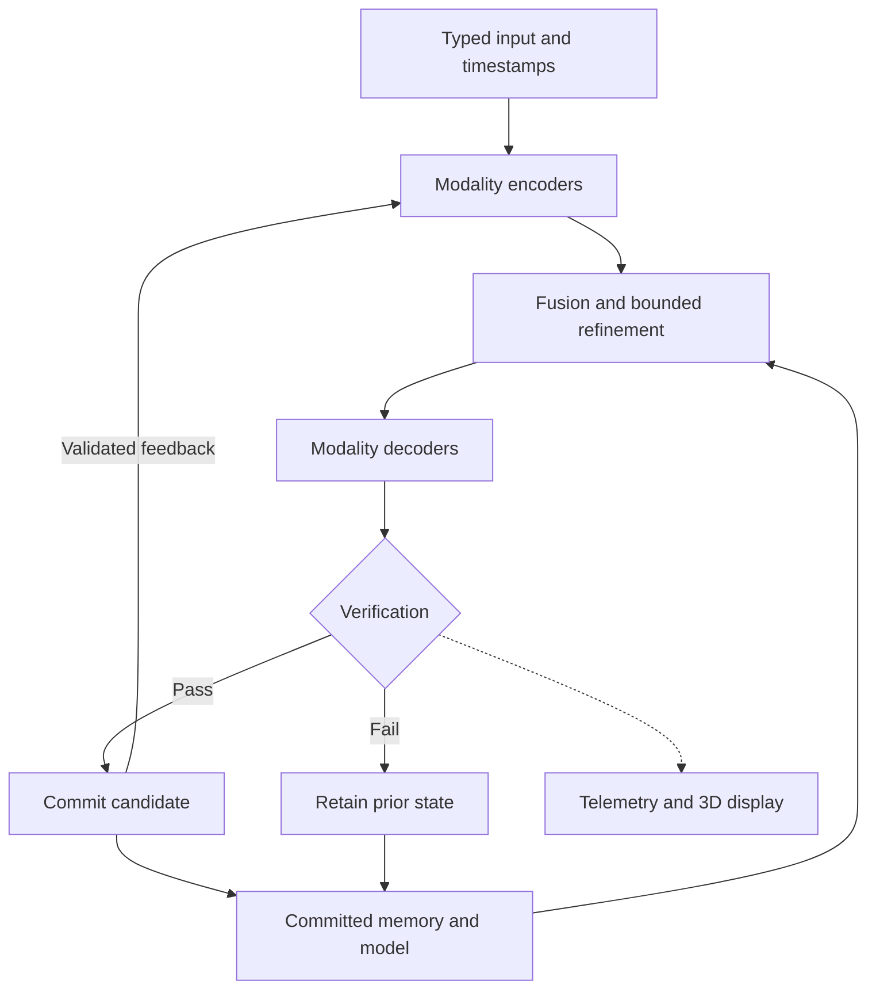

# Dr Moagi Multimodal AI Engine: End-to-End Operational and Mathematical 3D Breakdown

**Classification:** implementation-linked research specification.  
**Reviewed:** 2026-09-23.  
**Reference revision:** `ef6a040f470c8bafe5e81688f83051902c97b7c3` on `main`.  
**Attribution:** Matladi Maxwell Moagi; see the [canonical provenance](attribution/DR_MOAGI_EPHEMERAL_NOTION_FRAMEWORK.md).

This document gives the audio, vision and code-generation brief an explicit
mathematical and operational contract. Equations missing from the supplied
brief are reconstructed here as declared definitions, not recovered verbatim.
Implemented behavior, proposed integration and display geometry are identified
separately. Adding this specification does not add a new runtime or renderer.

The architectural authority remains [ADR-016](adr/0016-canonical-typed-state-transaction-and-geometry-profiles.md)
and [ADR-017](adr/0017-dr-moagi-operational-autoencoding-equation.md).

## 1. Implementation map

| Component | Evidence at the reference revision | Operational boundary |
|---|---|---|
| 3D multimodal loop | [`DrMoagiMultimodal3DLoop`](../src/jarvisx/dr_moagi_multimodal_loop.py) | Five byte-to-volume modalities, small shared-weight autoencoders, temporal history, weighted fusion, raw output and cycle-error measurement |
| Neural multimodal engine | [PR #310](https://github.com/Lord-Xido/Jarvis-X/pull/310), reviewed at `5eda351b14a50910ca74883ef4c940f97da64900` | Open integration candidate, absent from the inspected `main`; its [branch documentation](https://github.com/Lord-Xido/Jarvis-X/blob/5eda351b14a50910ca74883ef4c940f97da64900/docs/MM3D_ENGINE.md) describes learned fusion, voxel attention and an AdamW training path |
| Measured source-emission model | [Code Print-Rate Continuum](DR_MOAGI_CODE_RATE_CONTINUUM.md) | A separate finite source-emission experiment; its timings do not measure this multimodal loop |
| AVX-512 kernel | [ADR-025](adr/0025-avx512-volumetric-fold-kernel.md) | Separate Boolean block-fold kernel with scalar fallback; it is not an attention/tensor-contraction backend for this loop |
| Candidate commit and rollback | [Canonical system equation](DR_MOAGI_OPERATIONAL_AUTOENCODING_EQUATION.md) | Integration contract; the current multimodal loop only gates individual model updates by local reconstruction loss |
| Icosahedral core, rings and vortex | Section 6 below | Proposed telemetry visualization; no physical gravity, relativistic computation or quantum transport is implied |

The checked reference uses `visual`, `audio`, `text`, `video` and `generic`.
Code may be supplied as bytes to `generic` or `text`, but this does not create an
AST parser, compiler, instruction stream or semantic code generator. The
neural candidate in PR #310 has a separate code head; that is still distinct
from verified executable-code generation.

## 2. Inputs, state and 3D coordinates

### 2.1 Typed modality boundary

Let the outer iteration be an integer $t$. Its elapsed duration is measured
with a monotonic clock. It is not a Planck-time hardware step.

For a future semantic adapter, declare each input before encoding:

| Domain | Example input shape | Required interpretation |
|---|---|---|
| Audio | $X^a\in\mathbb R^{B\times C_a\times T_a}$ | PCM samples, sample rate, channels, normalization and timestamp |
| Vision/video | $X^v\in\mathbb R^{B\times T_v\times C_v\times H_v\times W_v}$ | Decoded frames, color space, frame times; depth requires its own units and source |
| Code | token sequence or typed AST graph | Language, tokenizer/grammar version, node/edge types and validity rules |

Temporal alignment needs an explicit common timebase, maximum skew and policy
for missing/late inputs. A shared tensor shape alone does not establish
cross-modal semantic alignment.

The existing `Payload3DAdapter` instead samples bytes, applies modality-specific
perturbations and `tanh`, and constructs a scalar cube. It does not perform an
STFT, decode PNG/WAV/MP4 containers, estimate semantic depth or parse an AST.
Its sampling and pooling are lossy; the generated payload is not a byte-exact
reconstruction of arbitrary input.

### 2.2 State and storage geometry

Use the canonical namespaces in the compact state

$$
S_t=(X_t,Z_t,\widehat X_t,e_t,\Omega_t,\Theta_t,
     \Pi_{\mathrm{run},t},R_{\mathrm{CTR},t},\mathrm{audit}_t).
$$

Continuous tensors can live in finite Euclidean spaces with the Frobenius
inner product. ASTs, queues and audit records are discrete state. The whole
system is therefore a mixed state space, not automatically one smooth
Riemannian manifold. A Riemannian extension would need a stated differentiable
domain and positive-definite metric $g_Z$; no learned metric is supplied by
the checked reference.

For a latent field, declare

$$
Z\in\mathbb R^{B\times C\times G\times G\times G},\qquad
i(x,y,z)=(zG+y)G+x.
$$

Here $0\le x,y,z<G$, x varies fastest, and

$$
x=i\bmod G,\quad y=\lfloor i/G\rfloor\bmod G,\quad
z=\lfloor i/G^2\rfloor.
$$

The reference has $B=C=1$, input edge $E=8$ and latent edge
$G=E/2=4$ by default: 512 input scalars and 64 latent scalars per modality.
It initializes five models with four scalar parameters each, for 20 adaptive
scalars in this reference. This is separate from PR #310's documented default
$B\times64\times6\times6\times6$ neural field.

## 3. Fusion and the executable reference equations

### 3.1 Encode, remember and fuse

For each modality $m$, input volume $V_t^m$, latent coordinate
$s=(x,y,z)$ and offset $\delta\in\{0,1\}^3$, the implemented encoder is

$$
Z_t^m(s)=\tanh\!\left(g_e^m\frac18
  \sum_{\delta\in\{0,1\}^3}V_t^m(2s+\delta)+b_e^m\right).
$$

The decoder uses the latent scalar $q=Z(s)$:

$$
D_m(Z)(2s+\delta)=\tanh\!\left(
  \tanh(g_d^m q+b_d^m)
  +0.025(\delta_x+2\delta_y+3\delta_z-3)q\right).
$$

With $K_t$ currently available history entries and $0\le\rho<1$,

$$
\bar Z_t^m=
\frac{\sum_{j=0}^{K_t-1}\rho^j Z_{t-j}^m}
     {\sum_{j=0}^{K_t-1}\rho^j},\qquad
e_t^m=\frac{\|V_t^m-D_m(\bar Z_t^m)\|_F^2}{E^3}.
$$

History entries retain the encoding produced at their own step; they are not
retroactively recomputed when the parameters change. Routing uses

$$
\alpha_t^m=
\frac{(10^{-6}+e_t^m)^{-1}}{\sum_j(10^{-6}+e_t^j)^{-1}},\qquad
Z_t^{\mathrm{sum}}=\sum_m\alpha_t^m\bar Z_t^m.
$$

Thus $\alpha_t^m>0$ and $\sum_m\alpha_t^m=1$. Low reconstruction error
gets more weight. This weighting is a reference heuristic, not proof that a
modality is more informative or correct.

### 3.2 Virtual coordinate conditioning

The reference's virtual counter is

$$
n_v=\left\lfloor\frac{\Delta t_{\mathrm{ns}}10^{24}}{10^9}\right\rfloor,
\qquad I=n_v\bmod10^{24}.
$$

Write $I=\sum_{j=0}^{23}d_j10^j$. Decimal deinterleaving gives

$$
a_\ell=\sum_{k=0}^{7}d_{3k+\ell}10^k,
\quad \ell\in\{0,1,2\},\quad
c_\ell=2a_\ell/(10^8-1)-1.
$$

These coordinates label a $(10^8)^3=10^{24}$ logical lattice without
materializing it. For latent site $(x,y,z)$, the actual fused field is

$$
Z_t^f(x,y,z)=\tanh\!\left[Z_t^{\mathrm{sum}}(x,y,z)
 +\gamma\sin\!\left(\pi\frac{c_0(x+1)+c_1(y+1)+c_2(z+1)}G\right)\right],
$$

with default $\gamma=0.035$. Virtual counter increments are not completed
tensor operations. Deterministic runs supply $n_v$ directly instead of
sampling elapsed time.

### 3.3 Proposed multi-head extension

A shape-compatible realization of the brief's multi-head fusion can use
modality tokens $H_m\in\mathbb R^{B\times N_m\times d}$, explicit modality
and position embeddings, and concatenated tokens $H$ of length
$N=\sum_mN_m$. For head $h$, set

$$
Q_h=HW_h^Q,\quad K_h=HW_h^K,\quad V_h=HW_h^V,
\qquad A_h=\operatorname{softmax}_{\rm key}
 \!\left(Q_hK_h^\top/\sqrt{d_k}+M\right)V_h.
$$

Here the mask $M$ represents padding/allowed attention and each query must
have at least one valid key. Then

$$
\Phi_{\rm attn}(H)=\operatorname{Concat}_h(A_h)W^O.
$$

This is the standard scaled-dot-product construction described in
[Vaswani et al., sections 3.2.1–3.2.2](https://arxiv.org/html/1706.03762v7).
A declared resampler must map its $N$ outputs to $G^3$ sites before
reshaping into a cube; an arbitrary token count cannot simply be reshaped.
Dense attention has quadratic interaction cost in $N$. This extension is
not the implemented scalar weighted fusion above. PR #310 documents voxel
attention after its learned fusion, which is another specific arrangement.

## 4. Recursive inward loop and adaptation

The reference generates modality-conditioned volumes via

$$
\widetilde Z_t^m=(1-\mu)\bar Z_t^m+\mu Z_t^f,\qquad
\widehat V_t^m=D_m(\widetilde Z_t^m),\quad \mu=0.35\ \text{by default}.
$$

Self-observation and its measured error are

$$
Z_{\mathrm{self},t}^m=E_m(\widehat V_t^m),\qquad
L_{\mathrm{cycle},t}^m=
\frac{\|Z_{\mathrm{self},t}^m-\widetilde Z_t^m\|_F^2}{G^3}.
$$

`step()` computes this cycle error but does not replace `inputs[m]` with
generated output and does not train on the cycle-error term. The actual
step order is local parameter update, encode, history, fusion, decode,
self-observation and metrics. No source compilation occurs.

The four parameters per modality are updated from the direct reconstruction
objective $L(\theta)=\operatorname{MSE}(V,D_\theta(E_\theta(V)))$.
For parameter $p$, the implementation estimates an internal gradient:

$$
g_p=\frac{L(\theta+h e_p)-L(\theta-h e_p)}{2h},\qquad h=0.002,
$$

$$
\theta'_p=\operatorname{clip}_{[-3,3]}
\!\left(\theta_p-0.08\operatorname{clip}_{[-4,4]}(g_p)\right).
$$

It accepts a finite candidate loss no greater than $L(\theta)+10^{-12}$
and otherwise restores the prior four parameters. This is finite-difference
optimization. Recurrence by itself does not change weights, and absence of an
external trainer does not mean absence of gradient steps. The local gate does
not establish generalization, whole-system rollback or atomic export.

### 4.1 Proposed bounded latent refinement

To implement an inner fixed-point solver, freeze the current input,
$\Theta_t$, memory and conditioning while iterating

$$
Z^{k+1}=F_{\Theta_t}(Z^k;X_t,\Omega_t),\qquad
\delta_k=\frac{\|Z^{k+1}-Z^k\|_F}{\max(1,\|Z^k\|_F)}.
$$

Stop at tolerance or an explicit iteration/time budget, and report which
condition ended the solve. A unique fixed point is guaranteed if $F$ maps
a nonempty closed subset of a finite-dimensional normed space into itself
and has a uniform Lipschitz constant $q<1$ there. Then
$\|Z^k-Z^*\|\le q^k\|Z^0-Z^*\|$.
The reference does not establish these assumptions for its evolving loop.

Its `fixed_point_delta` is instead RMS change in a sampled output signature
(up to 16 values per modality). Three small successive deltas set `converged`
by default. This is an empirical sampled-stability flag; it does not inspect
the entire state or prove semantic correctness. Changing parameters, inputs
or virtual conditioning changes the operator being observed.

### 4.2 Proposed closed-loop promotion

For actual output feedback, retain external input $U_{t+1}$ and admit a
bounded generated contribution through a modality-valid adapter:

$$
X_{t+1}^m=\operatorname{Mix}_m
  (U_{t+1}^m,\operatorname{Validate}_m(\widehat X_t^m);\beta_m).
$$

`Mix` may be a tensor blend for compatible continuous data or an explicit
selection/append policy for code. Numeric interpolation of ASTs is not
defined. Preserve provenance so generated evidence does not silently become
an independent external observation.

The canonical transaction is a structured choice:

$$
S_{t+1}=\begin{cases}
\Pi_\Lambda(S_{t+1}^{\rm cand}),&V_t=1,\\
S_t,&V_t=0.
\end{cases}
$$

All touched model, memory and runtime namespaces must be staged for this
whole-state contract. The current per-model loss gate implements only a
limited part of that requirement; see [issue #260](https://github.com/Lord-Xido/Jarvis-X/issues/260).

## 5. End-to-end integration topology

This diagram describes the proposed integration contract, including the
verification branch. Section 1 identifies which stages currently exist.



An implementable streaming boundary needs the following concrete contracts:

1. **Ingest:** timestamped payload descriptors, declared shapes, size limits
   and a bounded queue with an explicit backpressure/drop policy. The current
   file CLI reads payload bytes synchronously; it is not a ring-buffer system.
2. **Encode and fuse:** validate modality availability, finite values and
   tensor shapes. The current loop fills absent modalities with synthetic
   default payloads; a live pipeline must report or change this policy.
3. **Refine and decode:** cap active sites, recurrence steps and output size;
   preserve residual/side information if exact reconstruction is required.
4. **Verify:** compare declared reconstruction/task metrics, validate media
   formats, and parse/type-check generated code. Compilation and bounded
   execution are separate optional stages requiring their own receipts.
5. **Commit and recur:** stage changes, accept or retain prior state, record
   lineage, and enqueue only the admitted feedback contribution.

Zero-copy requires documented ownership, lifetime and synchronization for
shared buffers. Non-blocking execution requires a scheduling and queueing
implementation. Neither follows from writing a mathematical operator. The
reference allocates Python lists and output byte arrays. AVX-512 support in
another module does not establish accelerated multimodal tensor contraction.

## 6. 3D telemetry mapping

Let $\Pi_{\rm vis}:S\to\mathcal G$ map selected state or metrics to a
rendered scene. It is a many-to-one display map, not a reversible embedding
of every tensor, parameter or program into physical 3D space. Scene distance
does not inherit a physical meaning unless a calibration defines it.

### 6.1 Icosahedral core

Use a subdivided `IcosahedronGeometry` with unit vertex directions
$u_i$. The official [Three.js geometry contract](https://threejs.org/docs/pages/IcosahedronGeometry.html)
provides radius and detail controls. One proposed bounded deformation is

$$
p_i(t)=c+R_0\left[1+a\bar H(t)\sin(\omega_c t+\phi_i)\right]u_i,
\quad 0\le a<1,\quad 0\le\bar H\le1.
$$

This guarantees positive radial scale. Here $t$ is elapsed display time,
$\phi_i$ is a fixed vertex phase, and $\omega_c$ is radians per second.
Define a specific entropy before connecting it to the display. For example,
modality-routing concentration can be displayed with

$$
H_{\rm route}=-\sum_{m=1}^{M}\alpha_m\ln\alpha_m,\qquad
\bar H=H_{\rm route}/\ln M,\quad M\ge2,
$$

using $0\ln0=0$. This is dimensionless normalized routing entropy. It is
not an entropy rate, thermodynamic entropy, reconstruction error or an
intelligence score. The current CLI does not report it, although it exports
the fusion weights needed to calculate it. The quoted `0.0004%–0.00001%`
range has no supplied distribution, estimator, samples or measurement receipt.

### 6.2 Accretion vortex

For a finite illustrative particle set, an inward spiral with no singular
force evaluation is

$$
p_i(t+\Delta t)=c+e^{-\kappa\Delta t}
 R_y(\omega_i\Delta t)(p_i(t)-c),\qquad \kappa>0.
$$

$R_y$ is an orthogonal rotation around the y-axis. Therefore
$\|p_i(t+\Delta t)-c\|=e^{-\kappa\Delta t}\|p_i(t)-c\|$: radial
contraction is exact for this display model and independent of frame rate
before reset. The corresponding differential equation is

$$
\dot p_i=-\kappa(p_i-c)+\omega_i e_y\times(p_i-c).
$$

When the radius crosses $r_{\min}>0$, reset it to a declared outer radius
$R_{\max}>r_{\min}$, with a seeded emission direction for reproducible
replay. This is particle recycling. It is not quantum teleportation or a
physical event horizon. A renderer should cap catch-up work after a pause and
state its reset/time-step policy.

`4,000 particles` is a chosen display budget. A reset counter measures display
events unless particles have an explicit, timestamped correspondence to real
packets. It must not be relabeled as lines/s, AST tokens/s or tensor ops/s.

### 6.3 Toroidal rings

For major radius $R$, tube radius $r$, and angles $u,v\in[0,2\pi)$,

$$
p(u,v)=c+\begin{bmatrix}
(R+r\cos v)\cos u\\r\sin v\$R+r\cos v)\sin u
\end{bmatrix},\qquad R>r>0.
$$

[Three.js `TorusGeometry`](https://threejs.org/docs/pages/TorusGeometry.html)
can render this surface. Ring orientation/color may identify audio, vision
and code streams; rotation may display a bounded telemetry value. Those
visual assignments are design choices, not evidence of physical transport.

## 7. Scale, throughput and measurement

### 7.1 Symbolic extent

The expression $10^{6{,}000{,}000}$ can be retained symbolically as a
base/exponent pair. If independent rewrite sites have $\kappa_i$ choices,
then the assignment count is

$$
N_{\rm assignments}=\prod_i\kappa_i,\qquad
\log_{10}N_{\rm assignments}=\sum_i\log_{10}\kappa_i.
$$

An exponent of 6,000,000 requires that stated sum. Distinct legal-program
counts may be smaller because of constraints, dependencies and duplicate
outcomes. A compact representation does not enumerate, execute or verify all
assignments. No supplied evidence establishes that many emitted lines per
second. The reference's `10^24` virtual clock is also a different quantity.

### 7.2 Counters with explicit units

Over a declared measured interval $\Delta t>0$, report

$$
\tau_{\rm LPS}=N_{\rm emitted\ lines}/\Delta t,\quad
\tau_{\rm AST}=N_{\rm accepted\ AST\ nodes}/\Delta t,\quad
\tau_{\rm inst}=N_{\rm executed\ instructions}/\Delta t.
$$

These are different counters. Define newline/line rules, sink, flush policy,
AST acceptance criterion and instruction set before measuring. A code line
does not imply an AST node or a completed instruction. Count output accepted
by the named sink; buffered formatting throughput and durable-write
throughput need separate labels.

Tensor throughput similarly requires an operation-count convention and named
workload. Hardware TOPS, source lines, rendered particles, virtual addresses
and model quality are not interchangeable. End-to-end latency is measured
from the input acceptance timestamp to the verified output timestamp,
including queues and any training/compilation included in that path.

For materialized output with average $b$ bytes per line and sink bandwidth
$B_{\rm io}$ bytes/s, the output path alone requires
$\tau_{\rm LPS}\le B_{\rm io}/b$. Symbolic notation does not remove this
physical serialization constraint.

| Brief metric | Defensible operational representation | Evidence status |
|---|---|---|
| $10^{6{,}000{,}000}$ lines/s | Symbolic scale expression; measured LPS needs counted emissions and elapsed time | No such physical throughput measurement supplied |
| Entropy `0.0004%–0.00001%` | Name the probability distribution, estimator, normalization and observation interval | Unverified numeric range |
| $v/c=99.999\%$ | Scene units/s for animation; any physical velocity would require calibration and evidence | No physical relativistic-transport implementation established |
| Icosahedron and toroidal rings | Geometry and telemetry mapping in section 6 | Proposed display profile |
| Zero latency / evolutionary self-compilation | Timed feedback, explicit optimizer, compiler and execution stages | Absent from the checked reference |

For the reference, history is capped at 64 entries per modality. Tensor
storage scales as $O(M(E^3+KG^3))$, plus output buffers, input reading,
Python-object overhead and transient allocations. Input byte length, edge,
cycle count and export size still need deployment caps; a finite CLI argument
is not a comprehensive resource quota.

A performance receipt should contain revision, hardware/device, OS/runtime,
backend/dtype, input shapes and bytes, seed, warm-up, repetitions, counters,
elapsed time, latency distribution, peak memory, output sink and baseline.
Unmeasured fields remain `null`/`not_measured`, never an animation-derived
estimate presented as hardware telemetry.

## 8. Reproduce the existing bounded loop

From a repository checkout, without installing the optional neural backend:

```bash
PYTHONPATH=src python -m jarvisx.dr_moagi_multimodal_loop \
  --cycles 2 \
  --edge 8 \
  --deterministic-stride 100000000000000000000 \
  --out ./multimodal-out
```

This uses the reference's five synthetic default payloads. To use actual
payload bytes, provide `--input audio=path`, `--input visual=path`,
`--input video=path`, `--input generic=path`, and/or `--text`; these still use
the byte adapters described in section 2.

Outputs are five `generated-<modality>.raw` files, `metrics.json` and
`fused-latent.obj`. The raw files are not guaranteed to be playable media or
valid source code. The OBJ contains latent sample vertices, not the proposed
icosahedral/toroidal scene. Export writes files sequentially, not atomically.

A local Python 3.12.14 run of the exact command at the reference revision
produced the following rounded values on 2026-09-23:

| Quantity | Observed value |
|---|---:|
| Completed cycles / probes | 2 / 2 |
| Virtual counter | $10^{20}$ |
| Virtual address | `(0, 0, 1000000)` |
| Aggregate reconstruction MSE | `0.0212495` |
| Aggregate cycle MSE | `0.000561766` |
| Sampled output delta | `0.00495766` |
| `converged` | `false` |

These are correctness-smoke observations, not a performance benchmark or
evidence of semantic media quality. Floating-point results may vary across
environments. No LPS, TOPS or relativistic velocity was measured.

The four existing functions in
[`tests/test_dr_moagi_multimodal_loop.py`](../tests/test_dr_moagi_multimodal_loop.py)
also passed when invoked directly with a temporary-directory argument for
the export test. `pytest` was unavailable in the review environment, so this
was not a full pytest or repository-wide CI run. A development checkout with
pytest can run the focused file with:

```bash
PYTHONPATH=src python -m pytest tests/test_dr_moagi_multimodal_loop.py -o addopts=''
```

That command intentionally omits the repository-wide coverage threshold for
the focused smoke scope; normal full-suite CI retains its own configuration.

## 9. Integration acceptance

Promoting this specification into an operational multimedia pipeline needs
semantic codec/AST adapters, timed bounded queues, explicit training and
feedback policies, full candidate transactions, and measured stage receipts.
Validate reconstruction/task quality independently of self-consistency.
Keep PR #310's neural-engine integration distinct from the existing reference
and from the proposed renderer. A display consuming measured telemetry should
show its source and sampling interval; a simulation should identify itself.

The governing invariant remains:

$$
\boxed{\text{Encode}\to\text{Refine}\to\text{Decode}\to
\text{Verify}\to\text{Correct}\to\text{Remember}\to\text{Recur}.}
$$

Logical abstraction, physical implementation and measured performance remain
separate claims, each requiring its own evidence.
