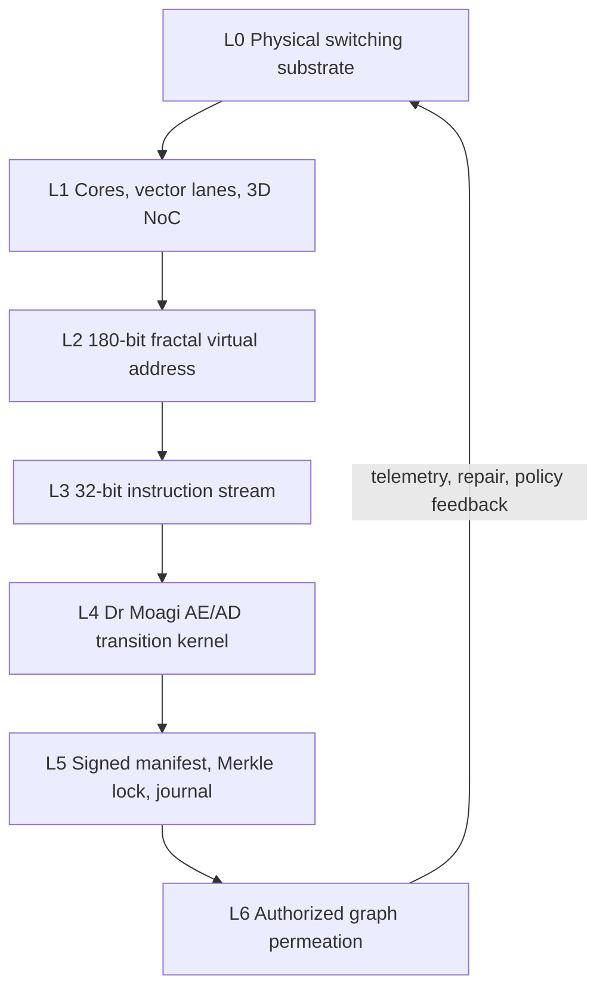

# Jarvis X 3D Multiparallel Mandelbulb AE/AD ISA

**Operational Arithmetic Specification — v1.0**  
**Status:** Architecture specification and scaling model  
**Scope:** Physical substrate, microarchitecture, fractal address space, 32-bit ISA, Dr Moagi auto-encoding/decoding kernel, integrity/IP lock, and authorized permeation

> This document separates three classes of statement:
>
> 1. **Implemented runtime facts** — properties of the executable neural-ROM core.
> 2. **Engineering assumptions** — values selected for an arithmetic design envelope.
> 3. **Conceptual upper bounds** — mathematically expressible scales that are not physically realizable with present hardware.
>
> The `10^72`-transistor and `10^54`-byte figures are conceptual address and scaling envelopes, not claims of fabricated silicon.

---

## 1. Canonical system state

The complete runtime state is

\[
\Sigma_t=
(\Psi_t,Z_t,A_t,\Pi_t,O_t,\Omega_t,\Lambda_t,J_t,C_t)
\]

where:

- \(\Psi_t\): operational 3D field or video/geometry state;
- \(Z_t\): encoded latent state;
- \(A_t\): fractal/ROM address distribution;
- \(\Pi_t\): opcode distribution;
- \(O_t\): hard selected opcode in deterministic inference;
- \(\Omega_t\): persistent residual memory;
- \(\Lambda_t\): numerical, policy, and integrity constraints;
- \(J_t\): hash-chained execution journal;
- \(C_t\): measured distributed coherence.

The seven layers form the closed loop

\[
L_0\rightarrow L_1\rightarrow L_2\rightarrow L_3\rightarrow
L_4\rightarrow L_5\rightarrow L_6\rightarrow L_0.
\]

---

# 2. Layer 0 — physical transistor grid

## 2.1 Conceptual population

Assume

\[
N_T=10^{72}
\]

transistors arranged as

\[
10^{24}\times10^{24}\times10^{24}.
\]

At an idealized 3 nm center-to-center spacing, one axis would have length

\[
L=10^{24}\times3\times10^{-9}=3\times10^{15}\ \text{m},
\]

which is approximately

\[
0.317\ \text{light-years}.
\]

Therefore, the full `10^72` grid is a cosmic-scale conceptual lattice, not a chip-scale geometry.

## 2.2 Switching energy

Use the stated event energy

\[
E_{sw}=0.16\ \text{fJ}=1.6\times10^{-16}\ \text{J}.
\]

Dynamic switching power is

\[
P_{dyn}=N_{active}\,a\,E_{sw}\,f_{clk},
\]

where \(a\in[0,1]\) is the average activity factor.

At

\[
f_{clk}=10^{10}\ \text{Hz},
\]

a transistor switching every cycle consumes

\[
P_{T}=E_{sw}f_{clk}=1.6\times10^{-6}\ \text{W}.
\]

### Conceptual sparse fraction

If \(f_a=10^{-9}\), then

\[
N_{active}=10^{72}\times10^{-9}=10^{63}.
\]

At \(a=1\), this implies

\[
P=10^{63}\times1.6\times10^{-16}\times10^{10}
 =1.6\times10^{57}\ \text{W}.
\]

The exponent is \(10^{57}\), not \(10^{58}\). Either value is physically impossible.

### 1.6 MW operating envelope

For

\[
P_{budget}=1.6\times10^6\ \text{W},
\]

the maximum simultaneously switching transistor count under the simplified model is

\[
N_{active}=\frac{P_{budget}}{aE_{sw}f_{clk}}
          =\frac{10^{12}}{a}.
\]

Thus:

- at \(a=1\): \(10^{12}\) switching transistors;
- at \(a=0.1\): \(10^{13}\) switching transistors.

This excludes leakage, clock distribution, memory, interconnect, cooling, and conversion losses, so it is an optimistic bound.

---

# 3. Layer 1 — logic and microarchitecture

## 3.1 Core population

Assume a minimal core uses

\[
N_{T/core}=5\times10^5
\]

transistors.

The conceptual all-transistor upper bound is

\[
N_{cores,max}=\frac{10^{72}}{5\times10^5}
             =2\times10^{66}.
\]

This is an arithmetic quotient, not a realizable machine.

## 3.2 Per-core switching power

At full activity:

\[
P_{core}=N_{T/core}E_{sw}f_{clk}
        =(5\times10^5)(1.6\times10^{-16})(10^{10})
        =0.8\ \text{W}.
\]

With activity factor \(a\):

\[
P_{core}=0.8a\ \text{W}.
\]

A 1.6 MW dynamic budget therefore supports approximately

\[
N_{cores,1.6MW}=\frac{1.6\times10^6}{0.8a}
                =\frac{2\times10^6}{a}
\]

active cores:

- \(2\times10^6\) cores at \(a=1\);
- \(2\times10^7\) cores at \(a=0.1\).

By contrast, \(10^{12}\) active cores require

\[
P=(10^{12})(0.8a)=8\times10^{11}a\ \text{W}.
\]

At \(a=1\), that is **800 GW**, not 1.6 MW.

## 3.3 Instruction and vector throughput

Let:

- \(N_c\): active cores;
- \(f\): clock frequency;
- \(I\): retired scalar-equivalent instructions per cycle;
- \(W\): vector arithmetic lanes per instruction.

Then

\[
R_{inst}=N_cfI
\]

and the arithmetic lane rate is approximately

\[
R_{lane}=N_cfIW.
\]

For one scalar instruction per cycle:

- \(2\times10^6\) cores at 10 GHz: \(2\times10^{16}\) instructions/s;
- \(10^{12}\) cores at 10 GHz: \(10^{22}\) instructions/s, but at the power cost above.

A claim of 2,000 cycles for roughly \(2.64\times10^5\) primitive operations implies an effective width of

\[
W_{eff}\approx\frac{2.64\times10^5}{2000}=132
\]

operations per cycle. Therefore the 2,000-cycle macroblock figure assumes an approximately 128-lane SIMD/tensor engine, not a scalar 1-op/cycle core.

## 3.4 3D interconnect

The conceptual mesh coordinate is

\[
(x,y,z),\qquad x,y,z\in[0,10^{21}-1]
\]

if \(10^{63}\) nodes are arranged as a cube.

Physical performance cannot be inferred from node count alone. It requires at least:

- link bandwidth \(B_l\);
- router radix;
- hop latency \(t_h\);
- mean path length \(\bar h\);
- bisection width \(N_{bisect}\).

Approximate end-to-end latency is

\[
t_{net}\approx \bar h\,t_h + \frac{M}{B_{path}},
\]

and aggregate bisection throughput is

\[
B_{bisect}=N_{bisect}B_l.
\]

No global throughput claim is valid without these values.

---

# 4. Layer 2 — Mandelbulb fractal address space

## 4.1 Address volume

Each axis contains

\[
10^6\ \text{TB}=10^{18}\ \text{byte positions}.
\]

For a 3D byte-addressed cube:

\[
N_{bytes}=(10^{18})^3=10^{54}\ \text{bytes}.
\]

This equals

\[
10^{30}\ \text{yottabytes}
\]

under decimal SI units.

## 4.2 Address width

Per-axis address width is

\[
\lceil\log_2 10^{18}\rceil=60\ \text{bits}.
\]

The complete 3D coordinate therefore requires

\[
60+60+60=180\ \text{bits}.
\]

Equivalently:

\[
\lceil\log_2 10^{54}\rceil=180\ \text{bits}.
\]

A 32-bit instruction cannot contain a 180-bit absolute address. It must use:

- address registers;
- multiword literals;
- page/table translation;
- or a content-derived fractal address function.

## 4.3 Mandelbulb transform

For power \(p=8\), a Cartesian point \(\mathbf z_n=(x_n,y_n,z_n)\) is converted to spherical form:

\[
r_n=\sqrt{x_n^2+y_n^2+z_n^2},
\]

\[
\theta_n=\operatorname{atan2}(y_n,x_n),
\qquad
\phi_n=\arcsin(z_n/r_n).
\]

Then

\[
r'=r_n^8,\qquad
\theta'=8\theta_n,\qquad
\phi'=8\phi_n,
\]

and

\[
\mathbf z_{n+1}=\operatorname{Cartesian}(r',\theta',\phi')+\mathbf c.
\]

The fractal address operator is

\[
F_{MB}(\mathbf c,D)=Q\!\left(\mathbf z_D,\,D,\,\text{escape trace}\right),
\]

where \(Q\) quantizes the trace into the 180-bit virtual coordinate.

## 4.4 Depth recurrence

Two different recurrences must not be conflated:

- doubling: \(D_{t+1}=2D_t\), giving \(16,32,64,128,\ldots\);
- squaring: \(D_{t+1}=D_t^2\), giving \(16,256,65536,\ldots\).

The latter grows far faster and requires a hard resource cap.

## 4.5 Mapping rate

If one fractal point costs 100 cycles at 10 GHz:

\[
t_{point}=100\times100\ \text{ps}=10\ \text{ns},
\]

so one mapping lane processes

\[
R_{point}=10^8\ \text{points/s}.
\]

With \(W_f\) independent lanes:

\[
R_{point,total}=W_f\times10^8\ \text{points/s},
\]

subject to memory and interconnect limits.

---

# 5. Layer 3 — 32-bit ISA

## 5.1 Instruction word

A concrete 32-bit base encoding is:

| Bits | Field | Width |
|---:|---|---:|
| 31..24 | opcode | 8 |
| 23..20 | mode/precision | 4 |
| 19..15 | destination register | 5 |
| 14..10 | source A | 5 |
| 9..5 | source B | 5 |
| 4..0 | source C / short immediate | 5 |

This provides:

- 256 primary opcodes;
- 16 execution modes;
- 32 architectural registers;
- three-register or short-immediate forms.

Long immediates, 180-bit addresses, tensors, and cryptographic operands use prefix/extension words and register-indirect addressing.

## 5.2 Opcode families

| Range | Family | Examples |
|---|---|---|
| `0x00–0x1F` | scalar/vector control | NOP, MOV, BRANCH, HALT |
| `0x20–0x3F` | 3D geometry | TRANS, ROTATE, SCALE, CURVATURE |
| `0x40–0x5F` | video | ME_BLOCK, DCT, QUANT, CABAC |
| `0x60–0x7F` | AE/AD | ENCODE, DECODE, REWIRE, FEEDBACK |
| `0x80–0x9F` | fractal | MANDELBULB, FRACTAL_ADDR, DIST_EST |
| `0xA0–0xBF` | memory/multiplex | LOAD3D, STORE3D, MUX, SCATTER |
| `0xC0–0xDF` | integrity | HASH, VERIFY, SIGNCHECK, JOURNAL |
| `0xE0–0xFF` | permeation/system | DIFFUSE, SYNC, PROJECT_LAMBDA, TRAP |

## 5.3 Pipeline

The minimum in-order pipeline is

\[
\text{Fetch}\rightarrow\text{Decode}\rightarrow\text{Issue}\rightarrow
\text{Execute}\rightarrow\text{Memory}\rightarrow\text{Writeback}\rightarrow
\text{Verify/Commit}.
\]

At 10 GHz:

\[
T_{cycle}=\frac{1}{10^{10}}=100\ \text{ps}.
\]

One-cycle latency applies only to simple register operations. Geometry, DCT, search, hashing, and network synchronization are multicycle operations.

## 5.4 Neural-ROM micro-ISA

The executable permeated core uses a 9-opcode latent micro-ISA:

| ID | Opcode | Operational transform |
|---:|---|---|
| 0 | NOP | \(Z'=Z\) |
| 1 | DIFFUSE | depthwise 3D Gaussian smoothing |
| 2 | CURVATURE | discrete 3D Laplacian update |
| 3 | REWIRE | learned channel mixing |
| 4 | ENCODE | learned latent contraction |
| 5 | DECODE | learned latent expansion |
| 6 | FEEDBACK | bounded nonlinear feedback |
| 7 | BOUNDARY | explicit face/boundary projection |
| 8 | HALT | terminate by program decision |

The 32-bit ISA is the architectural layer; the 9-opcode set is a microcoded latent execution unit beneath it.

## 5.5 Macroblock throughput

For a 2,000-cycle vectorized macroblock path:

\[
R_{block/core}=\frac{10^{10}}{2000}=5\times10^6
\ \text{blocks/s}.
\]

An 8K UHD frame has

\[
\frac{7680}{16}\times\frac{4320}{16}=480\times270=129600
\]

16×16 macroblocks.

Therefore:

### 1.6 MW, full-activity simplified limit

With \(2\times10^6\) active cores:

\[
R_{block}=10^{13}\ \text{blocks/s},
\]

\[
R_{8K}=\frac{10^{13}}{129600}
      \approx7.72\times10^7\ \text{frames/s}.
\]

### 10^12 active-core conceptual limit

\[
R_{block}=5\times10^{18}\ \text{blocks/s},
\]

\[
R_{8K}=\frac{5\times10^{18}}{129600}
      \approx3.86\times10^{13}\ \text{frames/s}.
\]

Thus `10^15 FPS` is not produced by the stated 2,000-cycle and \(10^{12}\)-core assumptions; it would require approximately 25.9 times more block throughput. These figures also exclude frame I/O, memory bandwidth, synchronization, and codec dependencies.

---

# 6. Layer 4 — Dr Moagi auto-encoding/decoding kernel

## 6.1 Implemented 3D neural-ROM transition

For the executable core:

\[
\Psi_t\in\mathbb R^{B\times5\times6\times6\times6}
\]

contains

\[
5\times6^3=1080
\]

scalars per sample.

The latent state is

\[
Z_t\in\mathbb R^{B\times2\times2\times2\times16}
\]

with

\[
2^3\times16=128
\]

scalars, producing a nominal scalar compression ratio

\[
\frac{1080}{128}=8.4375:1.
\]

The full transition is

\[
Z_t=\mathcal E_\theta(\Psi_t),
\]

\[
A_t=\operatorname{softmax}(\mathcal A_\eta(Z_t))\in\Delta^{63},
\]

\[
\Pi_t=\sum_{c=0}^{63}A_t(c)\operatorname{softmax}(ROM_c)
\in\Delta^8,
\]

\[
Z'_t=\sum_{o=0}^{8}\Pi_t(o)T_o(Z_t),
\]

\[
\widehat\Psi_{t+1}=\mathcal D_\phi(Z'_t),
\]

\[
\Omega_{t+1}=\lambda_\Omega\Omega_t+
\eta_\Omega(\widehat\Psi_{t+1}-\Psi_t),
\]

\[
\boxed{
\Psi_{t+1}=\Pi_{\Lambda_t}\left[
(1-\eta)\Psi_t+\eta\widehat\Psi_{t+1}+\kappa\Omega_{t+1}
\right].
}
\]

This is the operational Dr Moagi equation for the current neural-ROM runtime.

## 6.2 Video/geometry encoder cost

Assume:

- block size \(B=16\);
- search width \(S=32\), giving \(S^2=1024\) candidates;
- four transformed 8×8 planes;
- latent dimension \(D=512\);
- \(K=4\) active experts.

### Motion estimation

The number of pixel comparisons is

\[
S^2B^2=1024\times256=262144.
\]

If subtraction, absolute value, and accumulation are counted separately, the primitive-operation estimate is

\[
3\times262144=786432.
\]

### Separable DCT

For one 8×8 plane, a direct separable estimate is

\[
2\times8\times8\times8=1024
\]

multiply-accumulates. Four planes require

\[
4096\ \text{MACs}=8192\ \text{FLOPs}
\]

when one MAC is counted as two FLOPs.

### Quantization

\[
N_Q=4\times8\times8=256
\]

scale/round operations.

### CABAC

If 256 symbols cost approximately 100 integer operations each:

\[
N_{CABAC}\approx25600
\]

integer operations. A claim of only 100 operations per whole block undercounts symbol processing.

### Mixture of experts

For \(E\) experts, gate scoring costs

\[
E\times D
\]

MACs.

With \(E=16\):

\[
8192\ \text{MACs}.
\]

A diagonal/vector expert costs

\[
KD=4\times512=2048\ \text{MACs},
\]

whereas a dense \(D\times D\) transform costs

\[
KD^2=4\times512^2=1048576\ \text{MACs}.
\]

Therefore MoE cost must state the expert topology.

### Corrected forward envelope

A lightweight diagonal-expert path is approximately

\[
0.79\ \text{M motion ops}
+0.008\ \text{M DCT FLOPs}
+0.0003\ \text{M quant ops}
+0.026\ \text{M CABAC ops}
+0.020\ \text{M gate/expert ops}
\approx0.84\ \text{M primitive operations/block}.
\]

A dense-expert path adds approximately 2.1 million FLOPs and is closer to 3 million primitive operations per block.

## 6.3 Loss

The constrained training objective is

\[
\mathcal L_\Omega=
\lambda_R\mathcal R+
\lambda_D\mathcal D_{perc}+
\gamma\mathcal L_{fractal}+
\delta\mathcal L_{meta}+
\mu\mathcal L_{contract}+
\nu\mathcal L_{integrity}.
\]

Where:

- \(\mathcal R\): entropy/rate estimate;
- \(\mathcal D_{perc}\): perceptual reconstruction loss;
- \(\mathcal L_{fractal}\): fractal-coordinate consistency;
- \(\mathcal L_{meta}\): bounded architecture/meta-controller objective;
- \(\mathcal L_{contract}\): transition stability penalty;
- \(\mathcal L_{integrity}\): manifest/journal consistency penalty.

Training cost is not universally `2× forward`. Depending on parameterization and optimizer, backward plus parameter-gradient computation is commonly about 2–3 times forward, making a complete training step roughly 3–4 times forward before optimizer and communication overhead.

## 6.4 Convergence

Define normalized transition residual

\[
r_t=\frac{\|\Psi_{t+1}-\Psi_t\|_2}
{\|\Psi_t\|_2+\varepsilon}.
\]

The runtime terminates by one of four explicit states:

\[
\{HALT,\ CONVERGED,\ MAX\_STEPS,\ FAULT\}.
\]

Convergence requires

\[
r_t<\tau
\]

for \(m\) consecutive cycles. A small gradient alone does not authorize arbitrary mutation of the loss. Plateau handling must remain inside \(\Lambda\)-constrained hyperparameter and architecture bounds.

---

# 7. Layer 5 — IP lock, integrity, and provenance

## 7.1 Threat model

The lock protects:

- source and binary integrity;
- model and ROM integrity;
- configuration provenance;
- authorized deployment identity;
- reproducible execution records.

It does **not**, by itself, create legal ownership or prevent disclosure from a public repository. Legal protection also depends on licensing, contracts, patents where applicable, access policy, and evidence of authorship.

## 7.2 Canonical manifest

Construct a canonical manifest \(M\) containing:

- source-tree hashes;
- ISA specification version;
- ROM tensor hash;
- model/checkpoint hash;
- build toolchain and dependency lock;
- configuration and policy hashes;
- dataset provenance references;
- license and author metadata.

Each artifact is hashed with SHA3-256 or BLAKE3. The artifact hashes form a Merkle tree with root

\[
H_{root}=MerkleRoot(H_1,\ldots,H_n).
\]

The root is signed:

\[
\sigma=Sign_{sk}(H_{root}\parallel version\parallel timestamp).
\]

Verification succeeds only when

\[
Verify_{pk}(\sigma,H_{root}\parallel version\parallel timestamp)=1.
\]

## 7.3 Encryption

The expression

\[
K=H\oplus SHA3(P_0)
\]

is not a one-time pad unless the pad is uniformly random, secret, message-length, and never reused.

For confidential artifacts, derive a key using HKDF/KMAC and use authenticated encryption:

\[
K_{enc}=HKDF(master,\ H_{root}\parallel context),
\]

\[
(C,tag)=AEAD\_Encrypt(K_{enc},nonce,plaintext,AAD).
\]

## 7.4 Threshold recovery

Shamir secret sharing should protect a compact encryption/signing recovery secret, not be distributed across \(10^{63}\) hypothetical cores.

For practical \((t,n)\), choose values such as \((3,5)\), \((5,9)\), or an organization-specific quorum. Naive share generation is

\[
O(nt)
\]

finite-field operations.

## 7.5 Runtime verification

Each cycle or checkpoint verifies:

\[
H_{local}=H_{expected}.
\]

On mismatch, the safe response is:

1. stop commit;
2. quarantine the node;
3. preserve evidence;
4. emit a signed fault record;
5. roll back to the last verified checkpoint;
6. require authorized recovery.

A destructive entropy cascade that randomizes weights is intentionally excluded: it destroys evidence, risks collateral corruption, and does not strengthen provenance.

## 7.6 Hash-chained journal

For record \(R_t\):

\[
J_t=SHA3\!\left(J_{t-1}\parallel CanonicalEncode(R_t)\right).
\]

Any mutation of an earlier record changes every subsequent journal root.

---

# 8. Layer 6 — authorized permeation

Permeation is defined as policy-controlled state synchronization over an authorized graph, not uncontrolled propagation to every accessible substrate.

Let

\[
G=(V,E)
\]

be the permitted node graph, \(L_G\) its graph Laplacian, and \(S_i(t)\) the state at node \(i\).

The network-state equation is

\[
\frac{dS}{dt}=-\kappa L_GS+\alpha(S^*-S)+U(t),
\]

where:

- \(\kappa\) is graph diffusion rate in \(s^{-1}\);
- \(\alpha\) is anchor convergence rate in \(s^{-1}\);
- \(S^*\) is the signed target state;
- \(U(t)\) contains authorized updates.

## 8.1 Explicit Euler

\[
S^{n+1}=S^n+\Delta t
\left[-\kappa L_GS^n+\alpha(S^*-S^n)+U^n\right].
\]

A linear stability condition is

\[
0<\Delta t<
\frac{2}{\kappa\lambda_{max}(L_G)+\alpha}.
\]

For a regular 3D finite-difference heat equation, a conservative condition is

\[
\Delta t\le
\frac{1}{6D/\Delta x^2+\alpha}.
\]

The earlier \(\Delta x^2/(2D)\) condition is one-dimensional; 3D diffusion introduces the factor 6.

## 8.2 Dimensional consistency

On an abstract network, \(\kappa\) has units \(s^{-1}\), not \(m^2/s\). A physical diffusivity \(D\) in \(m^2/s\) is valid only when the graph is embedded in physical space with a defined \(\Delta x\).

The relation

\[
D\sim c^2\tau
\]

requires a stated coherence time \(\tau\). Setting \(D=10^{16}\ \text{m}^2/s\) implies

\[
\tau\approx\frac{10^{16}}{(3\times10^8)^2}
\approx0.111\ \text{s},
\]

which is a model assumption, not a universal network constant.

Similarly,

\[
\alpha=10^{12}\ s^{-1}
\]

has a time constant

\[
\tau_\alpha=\alpha^{-1}=1\ \text{ps},
\]

which may describe a local hardware relaxation but not a wide-area distributed network.

## 8.3 Measured coherence

Define weighted coherence as

\[
C_t=
\frac{\sum_i w_i\,
\mathbf1[H_i=H^*]\,
\mathbf1[r_i<\tau]\,
\mathbf1[\Lambda_i=valid]}
{\sum_i w_i}.
\]

Then

\[
0\le C_t\le1.
\]

`100% coherence` may be reported only when every weighted authorized node verifies the signed root, satisfies the residual limit, and passes \(\Lambda\).

---

# 9. Multiparallel matrix multiplexing

Let \(P\) denote parallel partitions, \(M\) multiplexed state channels, and \(Q\) queued instruction streams.

The global state is partitioned as

\[
\Psi_t=\bigoplus_{p=1}^{P}\Psi_t^{(p)}.
\]

Each partition executes

\[
Z_t^{(p)}=\mathcal E^{(p)}(\Psi_t^{(p)}),
\qquad
Z_t'^{(p)}=T_{O_t^{(p)}}(Z_t^{(p)}).
\]

A routing tensor

\[
R_t\in\{0,1\}^{P\times M\times Q}
\]

selects which partition, channel, and instruction stream is active. Conservation requires

\[
\sum_{p,m,q}R_{pmq}\le R_{capacity}.
\]

The merged state is

\[
\Psi_{t+1}=\Pi_{\Lambda_t}\left[
\mathcal M\left(
\mathcal D^{(1)}(Z_t'^{(1)}),\ldots,
\mathcal D^{(P)}(Z_t'^{(P)})
\right)+\Omega_t
\right],
\]

where \(\mathcal M\) is a deterministic conflict-resolving merge operator.

Ideal speedup is

\[
S_{ideal}=P.
\]

Actual speedup follows

\[
S(P)=\frac{1}{s+(1-s)/P+o(P)},
\]

where \(s\) is serial fraction and \(o(P)\) is routing, synchronization, memory, and verification overhead.

---

# 10. Final integrated operator

The architecture is represented by

\[
\boxed{
\Sigma_{t+1}=
\mathcal P_{perm}^{\Lambda}
\circ
\mathcal L_{integrity}
\circ
\mathcal D_{ISA}
\circ
\mathcal T_{ROM}
\circ
\mathcal E_{ISA}
\circ
\mathcal F_{MB}
(\Sigma_t)
}
\]

with explicit memory and projection:

\[
\boxed{
\Sigma_{t+1}=
\Pi_{\Lambda_t}\left[
\Sigma_t+
P(\Sigma_t)-
E_t+
\Omega_t+
U_t
\right].
}
\]

A fixed point satisfies

\[
\Sigma^*=\Phi(\Sigma^*),
\]

but fixed-point existence, uniqueness, and convergence require measured contractivity or another stability proof. They are not implied solely by recursion.

---

# 11. Corrected performance envelope

| Metric | Arithmetic result | Classification |
|---|---:|---|
| Conceptual transistor population | \(10^{72}\) | conceptual upper bound |
| 3 nm cube side for \(10^{24}\) sites/axis | \(3\times10^{15}\) m | demonstrates non-chip scale |
| Switching event energy | \(1.6\times10^{-16}\) J | design assumption |
| Minimal core transistors | \(5\times10^5\) | design assumption |
| Core dynamic power at 10 GHz, \(a=1\) | 0.8 W | simplified bound |
| Active cores at 1.6 MW, \(a=1\) | \(2\times10^6\) | excludes system overhead |
| Active cores at 1.6 MW, \(a=0.1\) | \(2\times10^7\) | excludes system overhead |
| Power for \(10^{12}\) cores, \(a=1\) | \(8\times10^{11}\) W | 800 GW |
| Fractal virtual storage cube | \(10^{54}\) bytes | virtual/conceptual |
| Fractal address width | 180 bits | exact ceiling |
| 10 GHz cycle time | 100 ps | exact from assumption |
| 8K 16×16 macroblocks/frame | 129,600 | exact for 7680×4320 |
| 8K FPS at 2M cores, 2000 cycles/block | \(7.72\times10^7\) | ideal compute-only |
| 8K FPS at \(10^{12}\) cores | \(3.86\times10^{13}\) | conceptual, ~800 GW |
| Lightweight block operation estimate | ~0.84 M ops | corrected baseline |
| Dense-MoE block estimate | ~3 M ops | topology-dependent |
| Neural-ROM input scalars | 1,080 | implemented runtime |
| Neural-ROM latent scalars | 128 | implemented runtime |
| Nominal neural compression | 8.4375:1 | implemented geometry |
| Neural ROM cells | 64 | implemented runtime |
| Latent micro-opcodes | 9 | implemented runtime |
| Coherence | measured \(C_t\in[0,1]\) | never assumed 100% |

---

# 12. Lock declaration

The architecture is considered **arithmetically sealed** only in the following precise sense:

1. every quantity has units or is explicitly dimensionless;
2. every throughput claim states its clock, width, active-core, memory, and power assumptions;
3. every address claim states its bit width and translation mechanism;
4. every cryptographic claim uses standard primitives and signed manifests;
5. every permeation path is authorized by \(\Lambda\);
6. every runtime transition is journaled and reproducible;
7. every convergence claim is backed by a residual, termination state, or proof.

The invariant is

\[
\boxed{
Reality>\theta,
\quad
\Omega\ \text{retains correction},
\quad
\Lambda\ \text{gates commitment},
\quad
J\ \text{preserves provenance}.
}
\]
