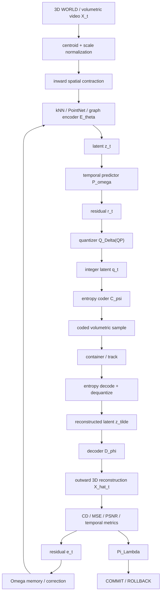

# Dr Moagi 3D Inward Volumetric Codec — End-to-End Operational & Mathematical Specification

**Status:** proposed Layer 5 integration contract  
**Scope:** volumetric video / point-cloud encode, latent quantization, entropy coding, decode, reconstruction, recursive refinement  
**Authority:** candidate state only until normal `Pi_Lambda` validation and COMMIT/ROLLBACK

## 1. Purpose

This specification formalizes a recursive 3D inward auto-encoding / outward decoding system for dynamic volumetric data.

The canonical codec chain is

```text
X_t
  -> normalize / inward geometry
  -> E_theta
  -> z_t
  -> temporal prediction
  -> residual r_t
  -> quantize Q_Delta
  -> entropy code C_psi
  -> coded sample / container
  -> entropy decode
  -> dequantize
  -> z_tilde
  -> D_phi
  -> X_hat_t
  -> distortion / rate / stability validation
  -> residual correction
  -> next inward pass
```

Compactly,

```math
X_t
\xrightarrow{E_\theta}
z_t
\xrightarrow{Q_\Delta}
q_t
\xrightarrow{\mathcal C_\psi}
B_t
\xrightarrow{\mathcal C_\psi^{-1}}
\tilde q_t
\xrightarrow{Q_\Delta^{-1}}
\tilde z_t
\xrightarrow{D_\phi}
\hat X_t.
```

The recursive codec operator is

```math
\mathcal F
=
D_\phi
\circ Q_\Delta^{-1}
\circ Q_\Delta
\circ E_\theta.
```

The geometric inward fold is an organizational transform. It is not, by itself, information compression.

## 2. Volumetric input representation

For frame `t`,

```math
X_t=\{\mathbf x_i(t)\}_{i=1}^{N_t},
\qquad
X_t\in\mathbb R^{N_t\times d}.
```

For geometry, colour and surface normal,

```math
\mathbf x_i=
\begin{bmatrix}
\mathbf p_i\\
\mathbf c_i\\
\mathbf n_i
\end{bmatrix}
=
\begin{bmatrix}
x_i&y_i&z_i&r_i&g_i&b_i&n_{x,i}&n_{y,i}&n_{z,i}
\end{bmatrix}^{T}.
```

If all components use the same scalar precision `b`,

```math
S_{raw}(t)=N_t d b
```

bits per frame.

With separate component precisions,

```math
S_{raw}(t)
=
N_t(3b_p+3b_c+3b_n).
```

For a sequence,

```math
S_{seq}=\sum_{t=0}^{T_f-1}S_{raw}(t).
```

## 3. Spatial normalization and inward contraction

The spatial centroid is

```math
\boldsymbol\mu_t=
\frac{1}{N_t}\sum_{i=1}^{N_t}\mathbf p_i(t).
```

Centered coordinates are

```math
\mathbf r_i(t)=\mathbf p_i(t)-\boldsymbol\mu_t.
```

A scale-normalized representation may use

```math
s_t=\max_i\|\mathbf r_i(t)\|_2+\epsilon,
\qquad
\bar{\mathbf p}_i=
\frac{\mathbf p_i-\boldsymbol\mu_t}{s_t}.
```

The encoder-side inward geometric trajectory uses phase `tau in [0,1]` and contraction factor

```math
\lambda(0)=1,
\qquad
\lambda(1)=\lambda_{min}>0.
```

One admissible schedule is

```math
\lambda(\tau)
=
\lambda_{min}
+
(1-\lambda_{min})e^{-\kappa\tau}.
```

Then

```math
\boxed{
\mathbf p_i^{in}(\tau)
=
\boldsymbol\mu_t+
\lambda(\tau)
(\mathbf p_i-\boldsymbol\mu_t)
}
```

with radial velocity

```math
\frac{\partial \mathbf p_i^{in}}{\partial\tau}
=
\lambda'(\tau)
(\mathbf p_i-\boldsymbol\mu_t).
```

For `lambda'(tau)<0`, the trajectory is inward.

## 4. Hierarchical spatial encoder

Construct a `k`-nearest-neighbour graph

```math
G_t=(V_t,E_t),
\qquad
\mathcal N_k(i)=\{j_1,\dots,j_k\}.
```

Message passing may use

```math
\mathbf m_{ij}^{(\ell)}
=
\phi_\theta(
\mathbf h_i^{(\ell)},
\mathbf h_j^{(\ell)},
\mathbf p_j-\mathbf p_i
)
```

and

```math
\mathbf h_i^{(\ell+1)}
=
\psi_\theta
\left[
\mathbf h_i^{(\ell)},
\operatorname{AGG}_{j\in\mathcal N(i)}
\mathbf m_{ij}^{(\ell)}
\right].
```

The aggregation operator must be permutation invariant, e.g.

```text
max | mean | sum
```

or another explicitly invariant reduction.

A PointNet-style global code is

```math
z_t
=
\rho_\theta
\left[
\max_{i=1,\ldots,N}
\phi_\theta(\mathbf x_i)
\right].
```

The abstract encoder contract is

```math
E_\theta:
\mathbb R^{N\times d}
\rightarrow
\mathbb R^m,
\qquad
m\ll Nd.
```

## 5. Temporal volumetric prediction

For volumetric video, temporal redundancy should be coded explicitly.

Define a predictor

```math
\bar z_t=P_\omega(z_{t-1},z_{t-2},\ldots)
```

and latent residual

```math
\boxed{
r_t=z_t-\bar z_t.
}
```

Intra-coded frames may code `z_t` directly. Predicted frames code `r_t`.

The decoder reconstructs

```math
\tilde z_t=\bar z_t+\tilde r_t.
```

An optional scene-flow predictor may use

```math
\mathbf p_i(t)
\approx
\mathbf p_i(t-1)+\mathbf v_i(t).
```

## 6. Quantization

Use a codec-style exponential quantizer schedule

```math
\boxed{
\Delta(QP)
=
\Delta_0
2^{(QP-QP_0)/6}.
}
```

For latent component `j`,

```math
q_j=
\operatorname{round}
\left(
\frac{r_j}{\Delta_j}
\right)
```

and

```math
\tilde r_j=q_j\Delta_j.
```

Thus

```math
\tilde r=r+\epsilon_q.
```

Under the high-resolution scalar-quantization approximation,

```math
\epsilon_{q,j}
\sim
\mathcal U
\left(
-\frac{\Delta_j}{2},
\frac{\Delta_j}{2}
\right),
\qquad
\operatorname{Var}(\epsilon_{q,j})
=
\frac{\Delta_j^2}{12}.
```

The uniform-noise model is an approximation, not a universal law.

## 7. Entropy model and coded rate

Let the entropy model estimate

```math
p_\psi(q_j\mid q_{<j},c_t).
```

The idealized coded rate is

```math
\boxed{
R(q_t)
=
-\sum_j
\log_2 p_\psi(q_j\mid q_{<j},c_t)
}
```

bits.

The rate-distortion objective is

```math
\boxed{
J_t
=
D(X_t,\hat X_t)
+
\beta R(q_t).
}
```

For a sequence,

```math
J_{seq}
=
\sum_t
\left[
D_t+
\beta R_t+
\gamma D_{temporal,t}
\right].
```

A composite volumetric distortion objective may be

```math
D
=
w_gD_{geometry}
+
w_cD_{colour}
+
w_nD_{normal}
+
w_tD_{temporal}.
```

## 8. Payload and container constraint

For duration `T` seconds and payload ceiling `S_max` bits,

```math
\boxed{
R_{max}=\frac{S_{max}}{T}.
}
```

For decimal 1 GB,

```math
S_{max}=8\times10^9\;\text{bits}.
```

For binary 1 GiB,

```math
S_{max}=8\times2^{30}\;\text{bits}.
```

The complete budget is

```math
\sum_t R_t
+
R_{side}
+
R_{container}
\le
S_{max}.
```

MP4 / ISO-BMFF is treated as a container boundary, not as the codec itself.

The operational chain is

```text
latent residual
  -> quantizer
  -> entropy coder
  -> coded volumetric sample
  -> sample metadata / side information
  -> MP4/ISO-BMFF or another container
```

A generic MP4 player cannot decode a custom latent volumetric track without the corresponding codec implementation and sample-entry semantics.

## 9. Decoder and outward reconstruction

The decoder contract is

```math
D_\phi:
\mathbb R^m
\rightarrow
\mathbb R^{N\times d}.
```

For a coordinate-conditioned implicit decoder,

```math
\hat{\mathbf x}_i
=
g_\phi(\tilde z_t,\mathbf u_i),
\qquad
\mathbf u_i\in\mathbb R^3.
```

For geometry,

```math
g_\phi:(\tilde z,\mathbf u)
\mapsto
\Delta\mathbf p
```

and

```math
\bar{\mathbf p}_i
=
\mathbf u_i+\Delta\mathbf p_i.
```

World coordinates are restored by

```math
\boxed{
\hat{\mathbf p}_i
=
\boldsymbol\mu_t+s_t\bar{\mathbf p}_i.
}
```

## 10. Outward geometric unfolding

Introduce decode phase `sigma in [0,1]` with

```math
a(0)=\lambda_{min},
\qquad
a(1)=1.
```

Then

```math
\boxed{
\mathbf p_i^{out}(\sigma)
=
\boldsymbol\mu_t
+
a(\sigma)
(\hat{\mathbf p}_i-\boldsymbol\mu_t).
}
```

This is a geometric visualization of the decoder trajectory. The actual reconstructed information is defined by `D_phi`, not by the radial expansion alone.

## 11. Quantization error propagated to geometry

A heuristic normal displacement such as

```text
(QP / 51) * normal * noise
```

may be useful for visualization, but the first-order decoder-space propagation is

```math
\boxed{
\delta X
\approx
J_D(z)\epsilon_q
}
```

where

```math
J_D=
\frac{\partial D_\phi}{\partial z}.
```

For vertex `i`,

```math
\delta\mathbf p_i
\approx
J_{D,i}\epsilon_q.
```

Normal-direction error is

```math
\delta_i^\perp
=
\mathbf n_i^T
J_{D,i}\epsilon_q
```

and the associated displaced point is

```math
\hat{\mathbf p}_i
=
\mathbf p_i
+
\delta_i^\perp\mathbf n_i.
```

## 12. Recursive inward loopback

The direct recursive loop is

```math
X_t^{(k+1)}
=
\mathcal F(X_t^{(k)}).
```

A stronger residual-correcting formulation uses

```math
e^{(k)}=X_t-\hat X_t^{(k)}
```

and

```math
z^{(k+1)}
=
z^{(k)}
+
C_\omega(e^{(k)}),
```

giving

```math
\hat X^{(k+1)}
=
D_\phi(z^{(k+1)}).
```

This avoids treating repeated lossy re-encoding alone as refinement.

## 13. Fixed-point condition

Let

```math
X^*=\mathcal F(X^*).
```

For a Banach fixed-point claim, the chosen state space must be complete and there must exist `q<1` such that

```math
\boxed{
d(\mathcal F(X),\mathcal F(Y))
\le
q\,d(X,Y).
}
```

Then

```math
d(X^{(k)},X^*)
\le
q^k d(X^{(0)},X^*).
```

An a-posteriori bound is

```math
d(X^{(k)},X^*)
\le
\frac{q^k}{1-q}
d(X^{(1)},X^{(0)}).
```

For differentiable finite-dimensional systems, a local diagnostic is

```math
\rho(J_\mathcal F(X^*))<1.
```

This is local evidence and does not replace a domain-wide contraction proof.

Ordinary symmetric Chamfer distance is retained as a reconstruction metric, but it is not used as the Banach metric because the common Chamfer formulation does not generally satisfy all metric axioms.

## 14. Reconstruction metrics

### 14.1 Symmetric squared Chamfer distance

For point sets `P` and `P_hat`,

```math
CD(P,\hat P)
=
\frac{1}{|P|}
\sum_{\mathbf p\in P}
\min_{\hat{\mathbf p}\in\hat P}
\|\mathbf p-\hat{\mathbf p}\|_2^2
+
\frac{1}{|\hat P|}
\sum_{\hat{\mathbf p}\in\hat P}
\min_{\mathbf p\in P}
\|\hat{\mathbf p}-\mathbf p\|_2^2.
```

### 14.2 Mean squared error

For aligned state tensors,

```math
MSE
=
\frac{1}{Nd}
\|X-\hat X\|_F^2.
```

For geometry only,

```math
MSE_{geom}
=
\frac{1}{3N}
\sum_i
\|\mathbf p_i-\hat{\mathbf p}_i\|_2^2.
```

### 14.3 PSNR

```math
PSNR
=
10\log_{10}
\frac{P_{max}^2}{MSE}.
```

`P_max` must be declared by the metric contract.

### 14.4 Additional recommended metrics

The runtime should also expose, where applicable:

```text
point-to-plane error
Hausdorff distance
normal angular error
F-score at declared spatial tolerances
temporal consistency error
coded bytes / frame
coded bytes / second
encode latency
decode latency
resident working set
```

## 15. Complete system state

Define

```math
S_t=
[
X_t,
z_t,
\bar z_t,
r_t,
q_t,
\tilde z_t,
\hat X_t,
e_t,
\Omega_t,
\Theta_t,
\Pi_t,
T_t
].
```

The operational recurrence is

```math
\begin{aligned}
z_t &= E_\theta(X_t,\Omega_t),\\
\bar z_t &= P_\omega(z_{<t}),\\
r_t &= z_t-\bar z_t,\\
q_t &= Q_{\Delta(QP_t)}(r_t),\\
B_t &= \mathcal C_\psi(q_t),\\
\tilde r_t
&=
Q_\Delta^{-1}
\left(
\mathcal C_\psi^{-1}(B_t)
\right),\\
\tilde z_t &= \bar z_t+\tilde r_t,\\
\hat X_t &= D_\phi(\tilde z_t),\\
e_t &= X_t-\hat X_t,\\
\Omega_{t+1}
&=
\rho\Omega_t
+
(1-\rho)\Gamma(e_t),\\
\Theta_{t+1}
&=
\Theta_t
-
\eta\nabla_\Theta
\left[
D_t+\beta R_t
\right].
\end{aligned}
```

## 16. Transaction and admission boundary

No candidate reconstructed state is authoritative before validation.

```text
candidate =
    encode
    -> predict
    -> quantize
    -> entropy code
    -> decode
    -> reconstruct
    -> measure

receipt =
    geometry metrics
    + temporal metrics
    + coded size
    + latency
    + resident memory
    + fixed-point evidence
    + model / codec versions

Pi_Lambda(candidate, receipt)
    -> COMMIT
    or
    -> ROLLBACK
```

The admission gate must fail closed on non-finite values, malformed payloads, budget overflow, version mismatch, missing side information, or declared metric violations.

## 17. System data flow



## 18. Implementation order

The intended implementation order is:

1. **Working** — deterministic point/tile representation, normalization, bounded encoder/decoder reference, scalar quantizer, metric receipt.
2. **Robust** — malformed-input rejection, resource ceilings, deterministic replay, candidate-first commit/rollback.
3. **Portable** — Python conformance reference plus C++ / WebAssembly-compatible numerical contract.
4. **Elegant** — temporal predictor, entropy model abstraction, explicit sample metadata and container adapter.
5. **Advanced** — learned graph/point encoder, GPU acceleration, VCN distributed workers, rate-control search, adaptive residual correction.

## 19. Relationship to Jarvis-X architecture

This specification is subordinate to:

- `docs/ARCHITECTURE.md`;
- `docs/DR_MOAGI_3D_AUTOENCODER.md`;
- `docs/DR_MOAGI_RUNTIME_FABRIC.md`;
- `docs/architecture/UNIFIED_3D_VCN_VISUALIZATION.md`;
- the canonical candidate-first `Pi_Lambda` admission boundary.

It defines the mathematical and operational codec contract for the volumetric branch of the Unified 3D VCN visualization. It does not replace the canonical deterministic VM and does not claim unmeasured compression ratios, throughput, or convergence.
