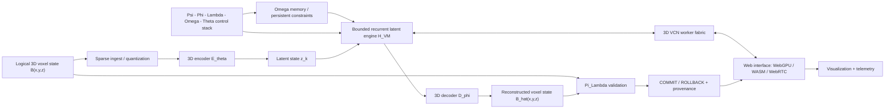
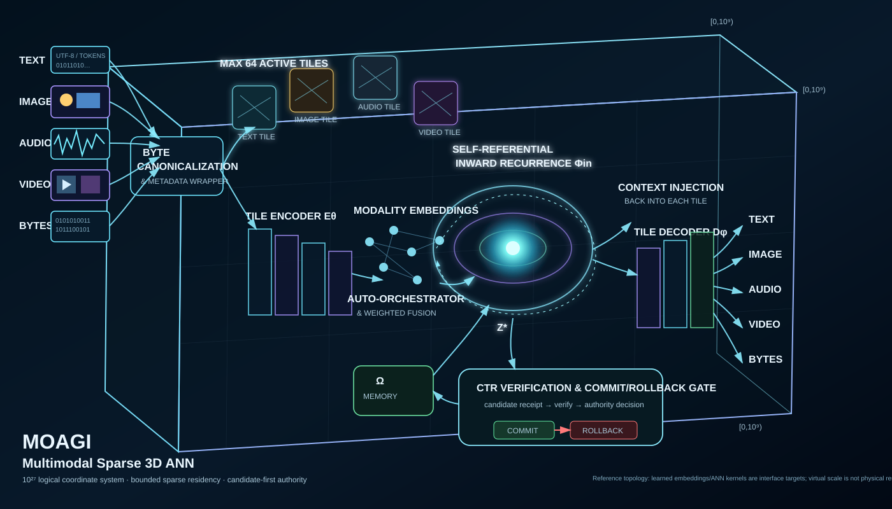

# Unified 3D VCN Operational Visualization

**Status:** integration specification / visualization contract  
**Scope:** Layer 4-6 research compute + interface topology  
**Authority:** non-authoritative until each candidate passes the repository's normal validation and promotion gates

## Purpose

This document translates the "Unified 3D VCN Operational Visualization" into the canonical Jarvis-X architectural vocabulary without promoting visual labels into unverified capability claims.

The visualization is treated as a system topology for:

- sparse high-resolution voxel input;
- 3D encoding and latent-state construction;
- global memory / constraint context;
- bounded recurrent latent refinement;
- 3D decode and reconstruction;
- distributed or swarm-style worker orchestration;
- browser-facing WebGPU / WebAssembly / WebRTC interfaces;
- telemetry and visualization.

It does **not** redefine the canonical VM, bypass `Pi_Lambda`, or make a rendering/diagram authoritative over executable state.

## Canonical topology



## Operational state contract

Let the authoritative candidate state be

```text
S_t = [X_t, z_t, Omega_t, Theta_t, Pi_t, T_t]
```

where:

- `X_t` is the bounded resident sparse voxel state;
- `z_t = E_theta(X_t)` is the latent representation;
- `Omega_t` is persistent residual / memory context;
- `Theta_t` is model/configuration state;
- `Pi_t` is policy/admission state;
- `T_t` is execution telemetry and provenance.

The recurrent candidate path is

```text
z_0 = E_theta(X_t)

z_(k+1) = Phi_in(
    z_k,
    Omega_t,
    Theta_t,
    Psi_t,
    Lambda_t
)

X_hat_t = D_phi(z_K)

e_t = X_t - X_hat_t
```

A candidate becomes authoritative only through

```text
S_(t+1) = Pi_Lambda(
    X_t,
    X_hat_t,
    e_t,
    z_K,
    Omega_t,
    Theta_t,
    resource_receipt,
    provenance_receipt
)
```

with explicit `COMMIT` or `ROLLBACK`.

## Mapping of the visualization to repository layers

| Visualization element | Jarvis-X interpretation | Canonical layer |
|---|---|---|
| high-resolution voxel cube | virtual sparse spatial state; resident support must be bounded | Layer 4 |
| 3D auto-encoder | optional adaptive / latent transform | Layer 5 |
| latent manifold | non-authoritative candidate representation | Layer 5 |
| global holographic memory buffer | bounded persistent state / residual memory, not literal holographic hardware | Layer 5 |
| Psi-Phi-Lambda-Omega-Theta stack | orchestration symbols for excitation, geometry/interaction, admissibility, memory and model state | Layer 5 |
| VM state engine | bounded recurrent candidate transform; does not replace canonical deterministic VM semantics | Layers 1 + 5 boundary |
| 3D decoder | candidate reconstruction transform | Layer 5 |
| 3D VCN engine / swarm | explicit worker fabric / distributed execution adapter | Layer 6 adapter to Layer 4/5 compute |
| WebGPU / WebAssembly / WebRTC | browser compute, portability and transport interfaces | Layer 6 |
| reconstructed voxel output | validated candidate output; not authoritative before promotion | Layer 5 -> admission boundary |

## VCN worker fabric

"VCN" is defined here as a **Volumetric Compute Network**: a versioned worker graph for partitioning sparse volumetric jobs.

Each worker node must expose a deterministic envelope:

```json
{
  "request_id": "uuid",
  "kernel": "encoder|latent-step|decoder|validate",
  "state_version": "sha256",
  "tile": {"x": 0, "y": 0, "z": 0, "extent": [0, 0, 0]},
  "input_digest": "sha256",
  "resource_budget": {
    "memory_bytes": 0,
    "cycles": 0,
    "deadline_ms": 0
  },
  "candidate_digest": "sha256",
  "telemetry": {},
  "validation": "provisional|accepted|rejected"
}
```

Worker results remain provisional until merged under the owning runtime's validation contract.

## Scale semantics

Numbers shown in visualization panels are interpreted as **logical geometry or illustrative compression telemetry** unless backed by a benchmark fixture.

Therefore:

- `1024^3` may denote a logical voxel address space;
- a compression ratio such as `262,144:1` is not treated as achieved lossless information compression without an executable codec, dataset and reconstruction/rate receipt;
- a visual swarm node count is topology, not throughput;
- "infinite", "septillion", or similar labels are not operational performance claims.

Jarvis-X must continue reporting separately:

```text
logical_extent
resident_working_set_bytes
materialized_voxels
measured_encode_latency
measured_decode_latency
measured_reconstruction_error
coded_size_bytes
worker_count
network_bytes
validation_result
```

## Browser execution contract

The web interface may use:

- **WebGPU** for bounded GPU kernels;
- **WebAssembly** for portable deterministic CPU kernels;
- **WebRTC** for explicit peer or media transport.

The browser layer is not trusted to self-promote state. It submits candidate results and receipts to the normal transaction boundary.

```text
browser worker
    -> candidate result
    -> digest + resource receipt
    -> host/runtime validator
    -> Pi_Lambda
    -> COMMIT or ROLLBACK
    -> provenance
```

## Stability criterion

For an inward latent refinement operator `F`, fixed-point convergence may be claimed only on a domain where the implementation establishes a contraction or equivalent sufficient condition.

A useful bounded diagnostic is

```math
\rho\left(J_F(z^*)\right) < 1
```

or an executable norm bound

```math
\|F(z_a)-F(z_b)\| \le q\|z_a-z_b\|, \qquad 0 \le q < 1.
```

Absent such evidence, the runtime reports empirical convergence only.

## Required implementation path

A production-facing realization of this diagram should be decomposed in this order:

1. **Working:** deterministic sparse voxel ingest -> encode -> latent-step -> decode -> validate loop.
2. **Robust:** candidate-first transaction, replay fixtures, resource ceilings, rollback and provenance.
3. **Portable:** Python reference plus C++ / WebAssembly conformance path.
4. **Elegant:** one versioned VCN request/result envelope across local, GPU and remote workers.
5. **Advanced:** WebGPU acceleration, distributed tile scheduling, multimedia adapters and measured rate-distortion optimization.


## Volumetric codec mathematical contract

The end-to-end mathematical and operational definition for the inward volumetric branch is specified in:

- `docs/architecture/DR_MOAGI_3D_INWARD_VOLUMETRIC_CODEC.md`

That document closes the visualization into an explicit sequence of spatial normalization, hierarchical encoding, temporal latent prediction, QP-scaled quantization, entropy coding, container budgeting, decoder-space quantization error propagation, reconstruction metrics, recursive residual correction, fixed-point evidence and `Pi_Lambda` admission.

## Relationship to existing repository contracts

This specification is subordinate to:

- `docs/ARCHITECTURE.md`;
- `docs/DR_MOAGI_3D_AUTOENCODER.md`;
- `docs/DR_MOAGI_RUNTIME_FABRIC.md`;
- the canonical candidate-first `Pi_Lambda` admission boundary;
- the invariant that visualization is not authority unless separately proven and tested.

The diagram is therefore best understood as a unified **operational visualization of the research compute envelope**, not as a replacement for the canonical deterministic execution core.

## Multimodal sparse 3D ANN visual



This visual binds the multimodal transport path to the same candidate-first
authority model: canonicalize inputs, materialize a bounded active tile set,
encode tile state, perform modality/context conditioning and weighted fusion,
refine a shared inward latent state, inject context back into each tile, decode,
then submit the reconstruction and residual receipts to CTR for commit or
rollback. The shown 10^27 coordinate cube is virtual address geometry and the
64-active-tile annotation is a bounded topology envelope, not a physical-memory
or throughput claim.

## C++ system-wide reference runtime

The bounded C++ mapping of this topology is implemented by:

- `cpp_runtime/src/systemwide_3d_map_main.cpp`
- `docs/DR_MOAGI_SYSTEMWIDE_3D_RUNTIME.md`
- CMake target `jarvisx-systemwide-3d-map`

The executable maps Reality -> multimodal ingest -> sparse virtual 3D addressing ->
active tiles -> encoder -> distributed latents -> orchestrator/fusion -> memory and
possibility fields -> inward refinement -> decoder -> residual -> codec boundary ->
CTR -> commit/serve, and exports OBJ, Graphviz and JSON receipts. Its
1000-MB-per-axis extent is virtual addressing semantics; only the bounded active
tile set is resident. The dependency-free block codec is a reference adapter,
not a trained ANN or production multimedia codec.

